# Restaurant Operations Management System

## 1. Problem Statement


### The Objective

Design and build an integrated, end-to-end **Restaurant Operations Management System** using a **Top-Down Approach**:

* **Phase 1 (Minimum Viable Core)**: Digitize the 3 mission-critical functions — **Menu Management**, **Order Taking (POS)**, and **Billing & Payment** — allowing the business to take orders and collect revenue seamlessly.
* **Human-in-the-Loop Fallback**: Non-core features (such as physical table assignment, oral kitchen callouts, and manual inventory spreadsheets) are temporarily managed by staff until subsequent phases.

---

## 2. Feature Breakdown (`docs/top-down-approach-mindmap.png`)

Based on the [Top-Down Architecture Mindmap](docs/top-down-approach-mindmap.png), the system is decomposed into 5 core functional modules:

```
                          ┌─ 1. Table & Reservation Management
                          ├─ 2. Order Management (POS) [Core Phase 1]
Restaurant Operations ────┼─ 3. Kitchen Coordination (KDS)
      System              ├─ 4. Back Office Management [Core Phase 1]
                          └─ 5. Payment & Invoicing [Core Phase 1]
```

### Module 1: Table & Reservation Management (Quản lý Bàn & Đặt chỗ)

* **Floor Plan Layout (Sắp xếp không gian quán)**:
  * Displays a visual table layout organized by dining zones (Floor 1, VIP rooms, Outdoor).
  * Uses color-coded indicators to quickly identify table states (*Vacant, Occupied, Reserved*).
* **Seating Coordination (Điều phối chỗ ngồi)**:
  * Opens tables when new guests arrive.
  * Merges adjacent tables into a single large table for group dining.
  * Transfers all active ordered items from one table to another when guests relocate.
* **Reservation Handling (Xử lý lịch hẹn trước)**:
  * Records advance guest booking details (guest name, contact, party size, arrival time).
  * Automatically/manually switches status from "Reserved" to "Serving" upon check-in.
  * Cancels no-show reservations after a configured grace period.

### Module 2: Order Management (Quản lý Đơn hàng) — *[Highlighted Core Phase 1]*

* **Order Entry (Ghi nhận món ăn)**:
  * Rapidly searches and filters dishes by category or name.
  * Adjusts dish quantities on the fly with stepper controls `[- 1 +]`.
  * Attaches custom dietary notes per line item (*e.g., no onion, less spicy, sauce on the side*).
* **Information Handoff (Chuyển giao thông tin)**:
  * Dispatches verified customer orders directly to the kitchen display and cashier desk.
* **Order Incident Handling (Xử lý sự cố gọi món)**:
  * Removes unsent items directly from the active cart.
  * Submits item cancellation requests (requiring manager authorization) if food has already been sent to the kitchen.

### Module 3: Kitchen Coordination (Điều phối Bếp / KDS)

* **Order Reception (Tiếp nhận yêu cầu)**:
  * Displays cooking tickets in chronological FIFO order (First In, First Out).
  * Clearly highlights special customer dietary notes attached to each item.
* **Preparation Progress (Báo tiến độ nấu nướng)**:
  * Updates item preparation stages (*Preparing, Cooked, Ready for Pickup*).
* **Stock Availability Alerting (Báo tình trạng món ăn)**:
  * Toggles an item to "Out of Stock" instantly, preventing front-of-house staff from taking further orders for that dish.

### Module 4: Back Office Management (Quản lý nhà hàng) — *[Highlighted Core Phase 1]*

* **Menu Management (Quản lý thực đơn)**:
  * Creates and updates dishes, sets base retail prices and VAT rates, uploads food photography, and structures dish categories.
* **Inventory Tracking (Quản lý kho hàng)**:
  * Monitors remaining raw ingredient balances in storage.
  * Logs supplier replenishment shipments and purchase invoices.
* **Staff & Access Control (Quản lý nhân sự)**:
  * Provisions employee accounts and assigns role-based permissions (Cashier, Server, Chef, Admin).
* **Business Performance Analytics (Theo dõi hiệu quả kinh doanh)**:
  * Renders revenue charts across daily, weekly, and monthly intervals.
  * Compiles top 5 best-selling dishes and underperforming items.

### Module 5: Payment & Invoicing (Thanh toán & Hóa đơn) — *[Highlighted Core Phase 1]*

* **Bill Calculation (Tính tiền)**:
  * Generates pre-bill previews summarizing food items, applied voucher codes, service fees (5%), and VAT (8%).
  * Deducts accumulated customer loyalty points.
* **Flexible Payments (Hỗ trợ cách trả tiền linh hoạt)**:
  * Supports multiple payment channels: Cash (with automatic change calculator), VietQR dynamic transfer, POS card swipe, and E-Wallets.
* **Document Handover (Bàn giao chứng từ)**:
  * Prints thermal pre-bills for table-side guest review.
  * Finalizes the sale and issues official electronic VAT invoices, automatically clearing the table for the next party.

---

## 3. Selected Core Features (Phase 1 MVP)

To resolve immediate operational bottlenecks while keeping scope manageable, **3 mission-critical features** were selected from the mindmap for Phase 1 implementation. Non-core functions (such as physical table seating, oral kitchen callouts, and manual inventory spreadsheets) temporarily operate under a **Human-in-the-Loop** model.

### Feature 1: Menu Management (Quản lý Thực đơn)
* **Operational Scope**:
  * Structures food & beverage offerings into clear categories (Appetizers, Beef, Seafood, Hotpot, Drinks, Desserts) with display ordering.
  * Maintains dish metadata: retail price, estimated cost price (for gross margin reporting), serving units, and VAT tax rate (8%).
  * **Real-time Stock Toggling**: Kitchen and management can instantly switch dish availability between `Available` (Đang bán) and `Out of Stock` (Tạm hết), synchronizing in real time with front-of-house ordering to prevent taking orders for depleted items.

### Feature 2: Order Taking / POS (Ghi nhận Gọi món)
* **Operational Scope**:
  * High-speed dish search and category filtering for swift table-side or counter ordering.
  * Line-item quantity stepper adjustments `[- 1 +]`.
  * **Custom Cooking Notes**: Attaches dietary requests per item (*e.g., "no onions", "less spicy", "sauce on the side"*).
  * Real-time order cart summarizing active items with subtotal previews before dispatching to the kitchen.

### Feature 3: Billing & Invoicing (Thanh toán & Hóa đơn)
* **Operational Scope**:
  * **Automated Financial Calculation**: Automatically computes food subtotal, validates discount vouchers (% or fixed amount), deducts VIP loyalty points, adds 5% service fee, and applies 8% VAT.
  * **Thermal Pre-Bill Printing**: Issues a pre-bill preview for table-side guest review before collecting payment.
  * **Multi-Channel Settlement**: Processes Cash (with automatic change calculation and quick tender presets), dynamic VietQR transfer codes, bank card POS swipes, and E-Wallets.
  * **Table Release**: Finalizes the sale, issues official electronic VAT invoices, and releases the table for the next dining party.

---

## 4. Database Architecture & Schema

The database architecture is designed directly around the **3 Selected Core Features** while establishing a robust foundation for the full 5 domains of restaurant operations:

* **Menu Domain** (`categories`, `dishes`): Centralized catalog, pricing, cost tracking, and instant stock availability.
* **Order Domain** (`orders`, `order_items`): Active dining sessions, line items with cooking notes, and the **Price Snapshot Pattern** (`unit_price`) to safeguard historical revenue records against future price edits.
* **Billing & Loyalty Domain** (`invoices`, `payments`, `vouchers`, `customers`): **Financial Immutability** upon invoice creation, loyalty points deduction, voucher discounts, and multi-channel payment records.
* **Operations & RBAC Domain** (`dining_tables`, `reservations`, `roles`, `users`): Floor plan zones, advance bookings, and role-based permissions.

### 4.1 Schema Specifications & Documentation
* **DBML Specification**: [`docs/schema.dbml`](docs/schema.dbml)
* **Detailed Visual ERD**: [`docs/database-erd.md`](docs/database-erd.md)
* **Vector ERD Graphic**: [`docs/schema.svg`](docs/schema.svg)

### 4.2 Visual Entity-Relationship Diagram

```mermaid
erDiagram
    ROLES ||--o{ USERS : "phân_quyền (1:N)"
    CATEGORIES ||--o{ DISHES : "phân_nhóm (1:N)"
    
    DINING_TABLES ||--o{ ORDERS : "phục_vụ_tại (1:N)"
    DINING_TABLES ||--o{ RESERVATIONS : "giữ_chỗ (1:N)"
    
    USERS ||--o{ ORDERS : "nhân_viên_mở_bàn (1:N)"
    ORDERS ||--|{ ORDER_ITEMS : "chi_tiết_gọi_món (1:N)"
    DISHES ||--o{ ORDER_ITEMS : "được_chọn_gọi (1:N)"
    USERS ||--o{ ORDER_ITEMS : "quản_lý_duyệt_hủy (1:N)"
    
    ORDERS ||--|| INVOICES : "chốt_hóa_đơn (1:1)"
    CUSTOMERS ||--o{ INVOICES : "tích_điểm_thành_viên (1:N)"
    VOUCHERS ||--o{ INVOICES : "áp_dụng_khuyến_mãi (1:N)"
    USERS ||--o{ INVOICES : "thu_ngân_chốt (1:N)"
    
    INVOICES ||--|{ PAYMENTS : "thanh_toán_qua (1:N)"

    ROLES {
        bigint id PK "Khóa chính"
        varchar name "Tên role: ADMIN, CASHIER, SERVER, KITCHEN"
        text description "Mô tả quyền hạn vai trò"
    }

    USERS {
        bigint id PK "Khóa chính"
        varchar username "Tên đăng nhập (Unique)"
        varchar password_hash "Mật khẩu băm an toàn"
        varchar full_name "Họ và tên nhân viên"
        bigint role_id FK "Liên kết vai trò: roles.id"
        varchar phone "Số điện thoại liên hệ"
        boolean is_active "Trạng thái hoạt động"
        timestamp created_at "Thời điểm tạo tài khoản"
    }

    CATEGORIES {
        bigint id PK "Khóa chính"
        varchar name "Tên nhóm: Khai vị, Bò, Hải sản, Lẩu..."
        int display_order "Thứ tự sắp xếp trên menu POS"
        boolean is_active "Đang áp dụng kinh doanh"
    }

    DISHES {
        bigint id PK "Khóa chính"
        bigint category_id FK "Thuộc nhóm: categories.id"
        varchar sku "Mã định danh món (Unique, vd: BO-FUJI-01)"
        varchar name "Tên món ăn"
        bigint price "Giá bán niêm yết hiện tại (VNĐ)"
        bigint cost_price "Giá vốn dự toán phục vụ tính margin"
        varchar unit "Đơn vị tính: Đĩa, Phần, Nồi, Ly"
        text image_url "Đường dẫn hình ảnh món"
        varchar status "Trạng thái: AVAILABLE | OUT_OF_STOCK | DISCONTINUED"
        boolean is_bestseller "Đánh dấu món bán chạy"
        int vat_rate "Thuế suất VAT (%)"
        timestamp created_at "Ngày tạo món"
    }

    DINING_TABLES {
        bigint id PK "Khóa chính"
        varchar table_number "Số bàn hiển thị (Unique, vd: 01, 05, VIP-1)"
        varchar zone "Khu vực: Tầng 1, Tầng 2, Sân vườn"
        int capacity "Sức chứa tối đa (số khách)"
        varchar status "Trạng thái: VACANT | OCCUPIED | RESERVED | CLEANING"
    }

    RESERVATIONS {
        bigint id PK "Khóa chính"
        bigint table_id FK "Bàn gán trước: dining_tables.id (Nullable)"
        varchar customer_name "Họ tên người đặt"
        varchar phone "Số điện thoại"
        int party_size "Số lượng khách dự kiến"
        timestamp reservation_time "Thời gian khách hẹn đến"
        varchar status "Trạng thái: PENDING | CONFIRMED | SEATED | CANCELLED"
    }

    ORDERS {
        bigint id PK "Khóa chính"
        varchar order_code "Mã phiên đơn (Unique, vd: #ORD-8821)"
        bigint table_id FK "Bàn đang phục vụ: dining_tables.id"
        bigint server_id FK "Nhân viên phục vụ mở bàn: users.id"
        int guest_count "Số lượng khách ngồi thực tế"
        varchar status "Trạng thái: OPEN | COOKING | SERVED | COMPLETED"
        timestamp opened_at "Thời điểm mở bàn đón khách"
        timestamp closed_at "Thời điểm đóng đơn / giải phóng bàn"
    }

    ORDER_ITEMS {
        bigint id PK "Khóa chính"
        bigint order_id FK "Thuộc đơn hàng: orders.id"
        bigint dish_id FK "Món ăn được gọi: dishes.id"
        int quantity "Số lượng món gọi"
        bigint unit_price "SNAPSHOT: Giá bán tại thời điểm gọi món"
        varchar cooking_note "Ghi chú bếp: Ít ngọt, Không cay, Nóng..."
        varchar status "Trạng thái: QUEUED | COOKING | READY | SERVED | CANCELLED"
        bigint approved_by FK "Quản lý duyệt hủy món: users.id (Nullable)"
        timestamp sent_to_kitchen_at "Thời điểm gửi thông tin xuống bếp"
    }

    CUSTOMERS {
        bigint id PK "Khóa chính"
        varchar phone "Số điện thoại thành viên (Unique)"
        varchar full_name "Họ tên khách hàng"
        varchar membership_tier "Hạng thẻ: STANDARD | SILVER | GOLD | PLATINUM"
        int loyalty_points "Điểm tích lũy hiện có"
    }

    VOUCHERS {
        bigint id PK "Khóa chính"
        varchar code "Mã giảm giá nhập (Unique, vd: VIPGOLD10)"
        varchar discount_type "Loại giảm: PERCENTAGE | FIXED_AMOUNT"
        bigint discount_value "Giá trị giảm (10% hoặc 20.000đ)"
        boolean is_active "Trạng thái kích hoạt"
    }

    INVOICES {
        bigint id PK "Khóa chính"
        varchar invoice_code "Mã hóa đơn VAT (Unique, vd: #HD-2026-0001)"
        bigint order_id FK "Đơn hàng được thanh toán: orders.id (Quan hệ 1:1)"
        bigint customer_id FK "Khách hàng tích điểm: customers.id (Nullable)"
        bigint voucher_id FK "Mã khuyến mãi áp dụng: vouchers.id (Nullable)"
        bigint subtotal "SNAPSHOT: Tổng tiền nguyên giá các món ăn"
        bigint voucher_discount "SNAPSHOT: Số tiền giảm trừ từ voucher"
        bigint points_discount "SNAPSHOT: Số tiền giảm trừ từ điểm thưởng"
        bigint service_fee_amount "SNAPSHOT: Số tiền phí dịch vụ (5%)"
        bigint vat_amount "SNAPSHOT: Số tiền thuế GTGT (8%)"
        bigint final_total "SNAPSHOT: TỔNG TIỀN PHẢI THU (Đã làm tròn)"
        bigint cashier_id FK "Thu ngân chốt đơn: users.id"
        timestamp created_at "Thời điểm xuất hóa đơn"
    }

    PAYMENTS {
        bigint id PK "Khóa chính"
        bigint invoice_id FK "Hóa đơn được thanh toán: invoices.id"
        varchar payment_method "Phương thức: CASH | VIETQR | CARD | WALLET"
        bigint amount_paid "Số tiền thực tế thanh toán qua kênh này"
        bigint amount_tendered "Số tiền khách đưa (nếu là tiền mặt)"
        bigint change_given "Số tiền thối lại cho khách (nếu là tiền mặt)"
        varchar transaction_ref "Mã giao dịch ngân hàng / VietQR"
        timestamp paid_at "Thời điểm xác nhận thanh toán"
    }
```


---

## 5. Interactive Frontend Prototype

The interactive prototype now brings together the full end-to-end operational loop across **4 integrated modules** in [`frontend/`](frontend/):

* **Tab 1: POS Gọi Món (Order Taking)** (`frontend/js/app.js`): Fast dish search, category filtering, steppers, dietary cooking notes modal, and cart items showing live kitchen preparation badges.
* **Tab 2: Bếp & Bar (KDS - Kitchen Display System)** (`frontend/js/app.js`): Chronological FIFO tickets with color urgency alerts (Green = New, Orange = Cooking, Red = Overdue >15 min), touch actions to advance cooking stages (`QUEUED` $\to$ `COOKING` $\to$ `READY`), quick dish 86 (Out of Stock) modal, and ticket recall.
* **Tab 3: Quầy Thu Ngân (Cashier & Invoicing)** (`frontend/js/app.js`): Real-time bill calculations (VAT 8%, 5% service fee), voucher validation, VIP points redemption, dynamic VietQR, thermal pre-bill printing, and cash change calculator.
* **Tab 4: Quản Lý Thực Đơn (Menu Admin)** (`frontend/js/app.js`): Dish drawer, price/cost editing, gross margin calculation, category management, and instant stock toggle synchronized with POS and KDS.
* **Sơ đồ Bàn & Đổi Bàn (Table Selector)**: Clickable table switcher in the top bar to inspect and transition between dining tables (Bàn 01, Bàn 02, Bàn 05, Bàn VIP-1, Bàn 10) with live status indicators (`VACANT`, `OCCUPIED`, `RESERVED`).

### How to Run
* Simply open [`frontend/index.html`](frontend/index.html) directly in any modern browser.
* Built with pure Vanilla JS and Tailwind CSS CDN — **Zero build steps, zero Node.js / Docker setup required**.


