# Restaurant Operations Management System

## 1. Problem Statement & Objective

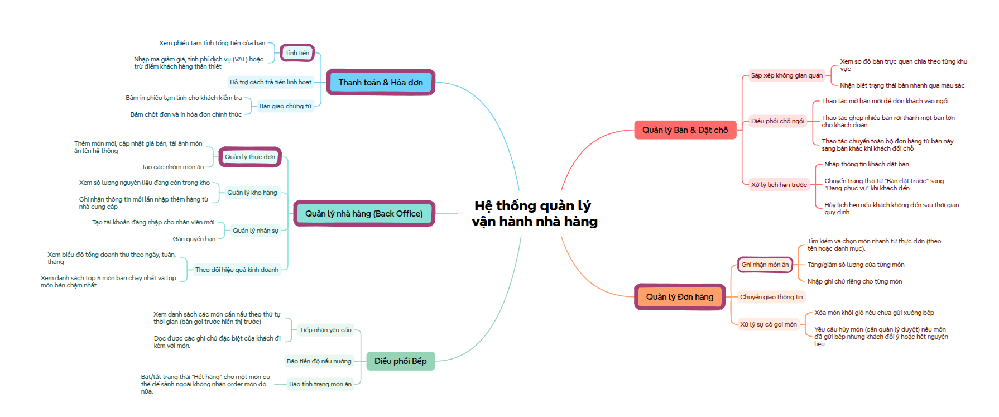

---

## 2. Feature Breakdown

Decomposed from the architecture mindmap (`docs/top-down-approach-mindmap.png`), the system comprises 5 functional modules:

```
                          ┌─ 1. Table & Reservation Management
                          ├─ 2. Order Management (POS)
Restaurant Operations ────┼─ 3. Kitchen Coordination (KDS)
      System              ├─ 4. Back Office & Menu Admin
                          └─ 5. Billing & Invoicing
```

| Module                                  | Core Scope                                                                                                      |      Note      |
| :-------------------------------------- | :-------------------------------------------------------------------------------------------------------------- | :------------: |
| **1. Table & Reservation**        | Visual floor plan, table statuses, seating coordination, advance reservations                                   |                |
| **2. Order Taking (POS)**         | Fast dish catalog search, live cart, dietary notes, add-on order batches                                        | **Core** |
| **3. Kitchen Coordination (KDS)** | Chronological FIFO tickets, station routing (Hot/Cold/Bar), cooking stages, out-of-stock alert (báo hết món) |                |
| **4. Menu Management**            | Catalog hierarchy, pricing, VAT, cost margin, instant stock availability toggle                                 | **Core** |
| **5. Billing & Invoicing**        | Pre-bill calculation, vouchers, VIP points, multi-channel payment (Cash/VietQR/Card/Wallet)                     | **Core** |

---

## 3. Selected Core Features (Phase 1 MVP)

To resolve immediate operational bottlenecks with optimal resources, **3 mission-critical features** were selected:

### Feature 1: Menu Management

* **Catalog Hierarchy**: Categorizes F&B offerings (Appetizers, Mains, Hotpot, Drinks, Desserts).
* **Pricing & Tax**: Maintains retail prices, estimated cost prices (gross margin reporting), serving units, and VAT rate (8%).
* **Real-time Stock Toggling**: Kitchen and management can instantly toggle item availability (`Available` $\leftrightarrow$ `Out of Stock`), preventing front-of-house staff from ordering depleted dishes.

### Feature 2: Order Taking / POS

* **High-Speed Ordering**: Category filtering, instant SKU/name search, and quantity stepper adjustments `[- 1 +]`.
* **Custom Dietary Notes**: Attaches line-item cooking requests (*e.g., less spicy, no onion, sauce on the side*).
* **Pre-bill & Add-on Orders**: Supports multi-round ordering (`isAddon: true`) without resetting active cooking statuses of previously sent items.

### Feature 3: Billing & Invoicing

* **Automated Financial Calculation**: Automatically computes food subtotal, validates vouchers, deducts VIP loyalty points, adds 5% service fee, and applies 8% VAT.
* **Pre-Bill Printing**: Issues table-side pre-bills for guest verification prior to payment collection.
* **Multi-Channel Settlement**: Handles Cash (with automatic change calculator), dynamic VietQR transfer, bank card POS, and e-wallets.
* **Table Release**: Finalizes transactions, issues official VAT invoices, and resets tables to "Vacant".

---

## 4. Actor Roles & Use Case Diagrams

Derived from the functional breakdown, the system defines 4 internal user roles and 1 external supporting system:

* **👤 Waitstaff (Server)**: Table seating, table-side ordering, item dietary notes, KDS dispatch.
* **👨‍🍳 Kitchen / Bar Staff**: FIFO order queue processing, cooking stages progression, out-of-stock alert (báo hết món).
* **💳 Cashier**: Pre-bill thermal printing, voucher & VIP point redemption, multi-channel payment reconciliation.
* **👔 Restaurant Manager / Admin**: Catalog maintenance, pricing/gross margin control, cancellation approval.
* **🏦 VietQR / Bank Gateway**: Dynamic QR generation and payment confirmation.

> 📄 **Detailed Specifications**: See [`docs/usecase-auth-specification.md`](docs/usecase-auth-specification.md) and interactive diagrams in [`docs/usecase-diagrams.html`](docs/usecase-diagrams.html).

---

### 4.1. System Context Overview

High-level architecture capturing interactions between the 4 primary actors and the core subsystem boundaries:

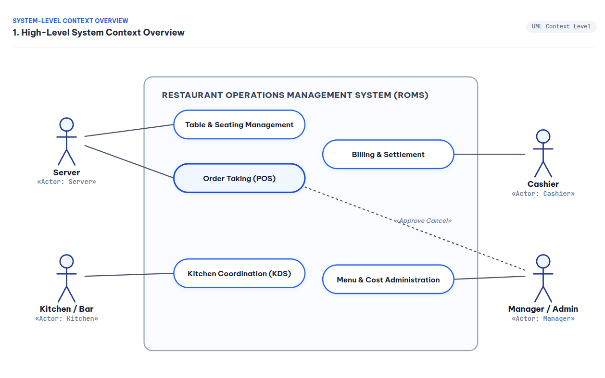

---

### 4.2. Server Use Case Diagram (Front-of-House Waitstaff)

Handles dining room floor management, guest reception, and table-side order taking:

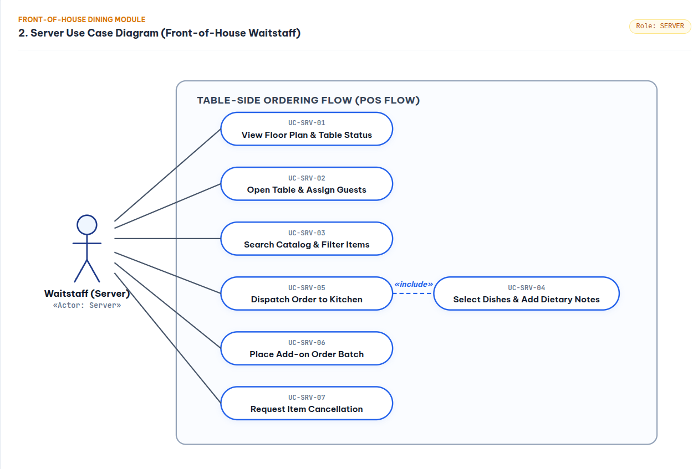

* **Key Scopes**:
  * `UC-SRV-01`: View Floor Plan & Table Status (Visual color cues: Vacant / Occupied / Reserved).
  * `UC-SRV-02`: Open Table & Assign Guests (Activates dining session, generates Order ID).
  * `UC-SRV-03` & `UC-SRV-04`: Search Catalog, select dishes, and attach custom dietary cooking requests (*e.g., less spicy, no onion*).
  * `UC-SRV-05`: Dispatch Order to Kitchen (`<<include>>` item selection).
  * `UC-SRV-06`: Place subsequent Add-on Order batches without disrupting active cooking items.
  * `UC-SRV-07`: Request item cancellation (subject to manager approval).

---

### 4.3. Kitchen / Bar Staff Use Case Diagram (KDS Flow)

Operates on touch-enabled Kitchen Display Systems (KDS) for chronological culinary preparation:

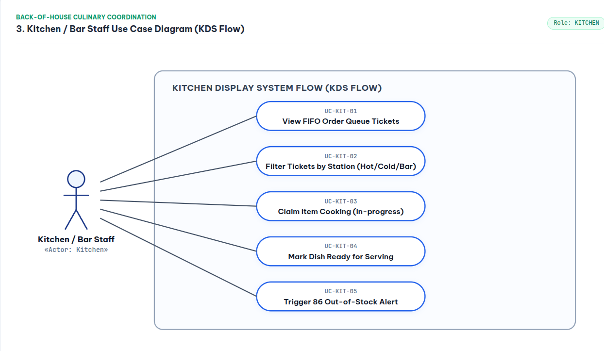

* **Key Scopes**:
  * `UC-KIT-01`: View incoming tickets in strict First-In-First-Out (FIFO) chronological order.
  * `UC-KIT-02`: Filter active tickets by station specialization (Hot Kitchen / Cold Salad / Bar).
  * `UC-KIT-03`: Claim item preparation stage (`QUEUED` $\to$ `COOKING`).
  * `UC-KIT-04`: Mark finished dishes as ready (`COOKING` $\to$ `READY`) to notify service runners.
  * `UC-KIT-05`: Instant out-of-stock alert switch (báo hết món tức thì) to freeze depleted items across all POS terminals.

---

### 4.4. Cashier Staff Use Case Diagram (Billing & Settlement)

Manages pre-bill issue, discount validation, fiscal calculation, and table release:

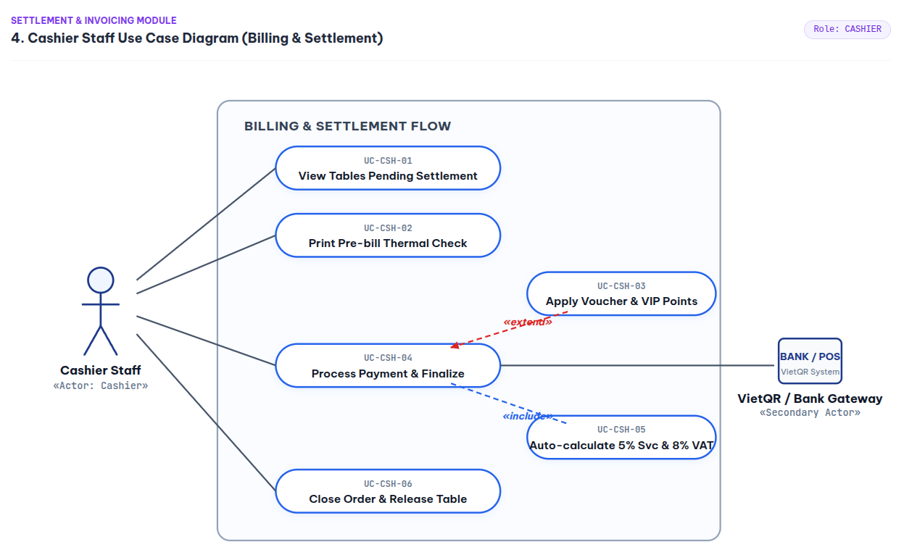

* **Key Scopes**:
  * `UC-CSH-01`: View all active tables currently pending bill settlement.
  * `UC-CSH-02`: Issue 80mm thermal pre-bills for tableside guest verification.
  * `UC-CSH-03`: Apply promotional discount vouchers and VIP loyalty point redemption (`<<extend>>`).
  * `UC-CSH-04`: Process multi-channel payment (Cash with change calculator, dynamic VietQR, Card POS).
  * `UC-CSH-05`: Automated fiscal calculation (`<<include>>` 5% service fee + 8% VAT).
  * `UC-CSH-06`: Close transaction, issue official VAT invoice, and release table to `VACANT`.

---

### 4.5. Restaurant Manager / Admin Use Case Diagram (Back Office)

Provides centralized governance over menu engineering, loss-prevention controls, and business performance:

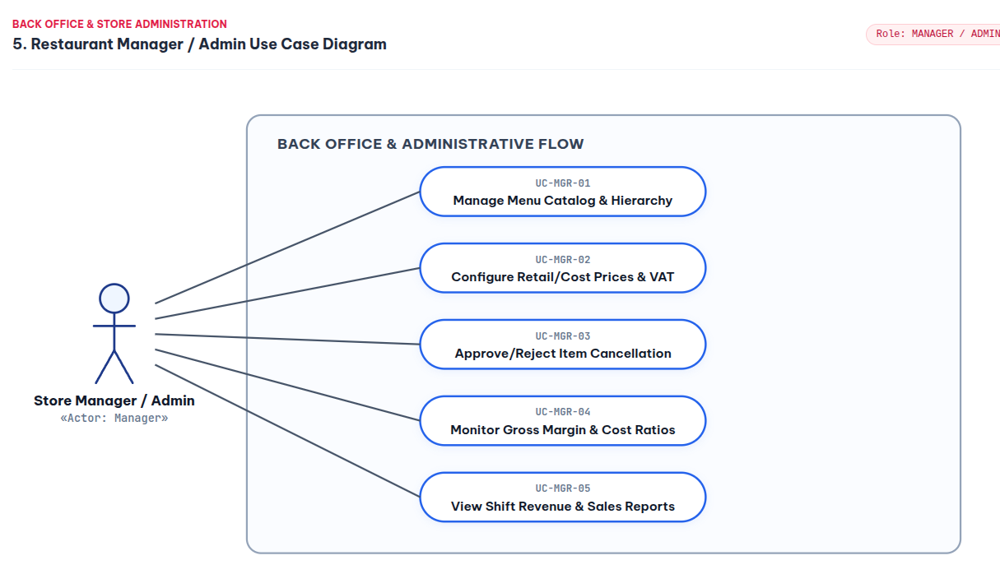

* **Key Scopes**:
  * `UC-MGR-01`: Menu catalog hierarchy maintenance (Categories, Dish CRUD, High-res images).
  * `UC-MGR-02`: Configure retail prices, estimated cost prices, and VAT rates.
  * `UC-MGR-03`: Review and approve/reject item cancellation requests initiated from floor staff.
  * `UC-MGR-04`: Real-time Gross Margin monitoring (`(Retail Price - Cost Price) / Retail Price`).
  * `UC-MGR-05`: Review shift revenues, payment channel breakdowns, and top-selling items.

---

## 5. Information Architecture & Wireframes (IA)

Bridging use case specifications to UI prototyping, the system architecture establishes clear screen hierarchy, operational decision task flows, and ergonomic low-fidelity wireframes:

* **Sitemap Mindmap**: High-level hierarchy connecting floor seating, table-side ordering, KDS, cashier settlement, and back office.
* **Ergonomic Spatial Layout**: Designed for rapid touch input, clear visual hierarchy, and instant operational feedback.
* **Standardized Nomenclature**: Unifying action labels (`Gửi Bếp`, `In Tạm Tính`, `Chốt Đơn & Thanh Toán`) and entity lifecycle states.

> 📄 **Complete IA Specification**: For detailed decision task flows (If/Else flowcharts), complete wireframe annotations, and metadata taxonomy dictionaries, see [`docs/information-architecture.md`](docs/information-architecture.md).

### 5.1. Screen Hierarchy & Sitemap Mindmap


### 5.2. Operational Decision Task Flows (Mermaid Workflows)

Standardized decision-tree workflows (`If/Else` branching) to prevent operational dead-ends and enforce validation across floor, kitchen, and checkout:

#### 5.2.1. Table Seating & Guest Check-In Flow

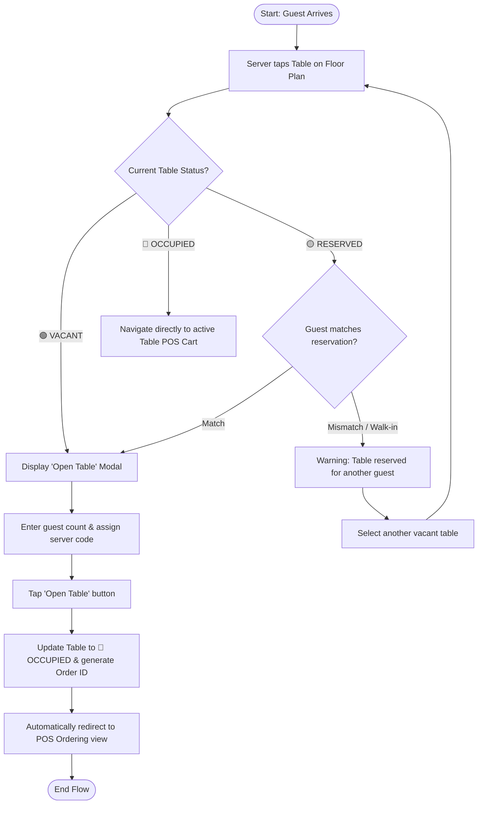

#### 5.2.2. POS Ordering, Stock Validation & Kitchen Dispatch Flow

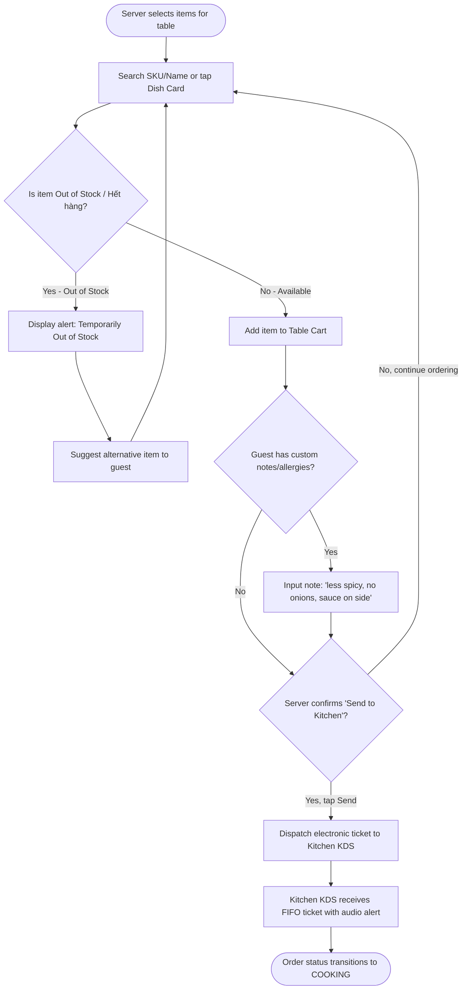

#### 5.2.3. Cashier Billing, Multi-Payment & Table Release Flow

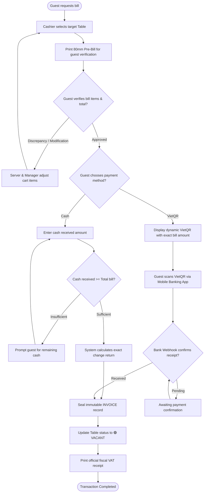

---

### 5.3. Core View Wireframes

#### A. Table-Side POS Ordering View


* **Ergonomic Focus**: Top quick navigation tabs, centered 6-card dish catalog with fuzzy search/filter, and right-side cart with real-time bill preview & direct "Trans2 kitchen" / "Payment" triggers.

#### B. Kitchen & Bar Display System (KDS)

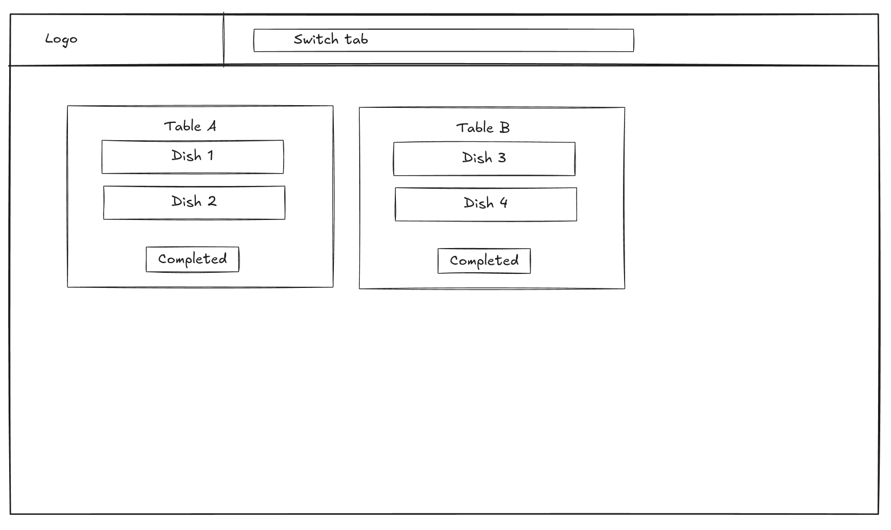

* **Ergonomic Focus**: Chronological FIFO table ticket queue (`Table A`, `Table B`), clear dish-item breakdown, and 1-tap `Completed` button to synchronize preparation status with floor staff.

#### C. Cashier & Invoicing View


* **Ergonomic Focus**: Top active table tabs, left bill breakdown (dishes, voucher, subtotal, VAT), and right customer loyalty info with dynamic multi-method settlement (Cash, VietQR, Card).

#### D. Admin & Margin Governance View

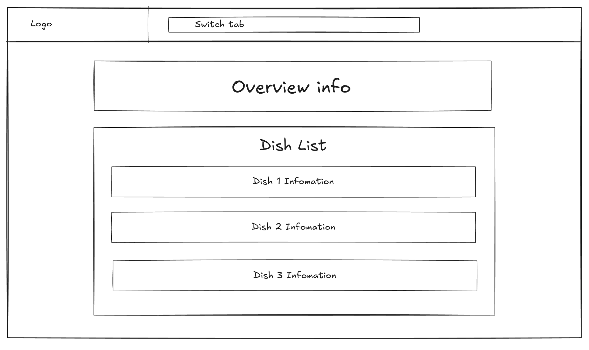

* **Ergonomic Focus**: Top KPI summary cards (Gross Margin %, shift revenue, active dishes) over the central menu catalog datatable with cost/price tracking and instant stock status toggling.

---

## 6. Database Architecture & Detailed ERD

The database schema is engineered directly around the **3 Selected Core Features** with enterprise-grade data integrity:

* **Price Snapshot Pattern** (`order_items.unit_price`): Preserves historical transaction prices against future menu price updates.
* **Financial Immutability** (`invoices`): Locks immutable financial figures upon invoice creation.
* **Multi-Method Payments** (`invoices 1 : N payments`): Supports split billing and hybrid settlement (Cash + VietQR).


> 📄 **Schema Details**: For raw DBML definitions and documentation, see [`docs/schema.dbml`](docs/schema.dbml) and [`docs/database-erd.md`](docs/database-erd.md).

---

## 7. Interactive Frontend Prototype & UI Screenshots

The system includes a fully functional interactive prototype in [`frontend/`](frontend/), demonstrating the complete operational cycle from floor ordering to kitchen coordination, cashier settlement, and menu margin governance:

### How to Run

* Open [`frontend/index.html`](frontend/index.html) directly in any modern browser.
* Built with **Pure Vanilla JS + Tailwind CSS CDN** — zero build steps, zero dependencies.

---

### 7.1. POS Order Taking View

Fast catalog search, category filtering, table cart with dietary notes, and instant out-of-stock indicators:

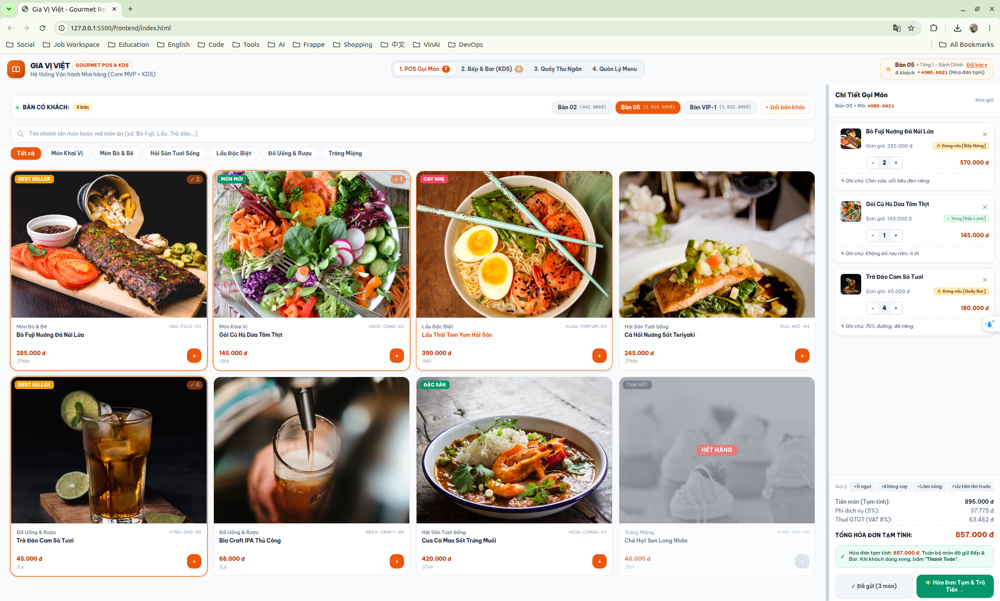

---

### 7.2. Kitchen & Bar Display System (KDS) View

Dark-mode ergonomic interface with real-time FIFO ticket queue, station filtering (Hot/Cold/Bar), cooking stage progression (`QUEUED` $\to$ `COOKING` $\to$ `READY`), and instant out-of-stock alert switch:

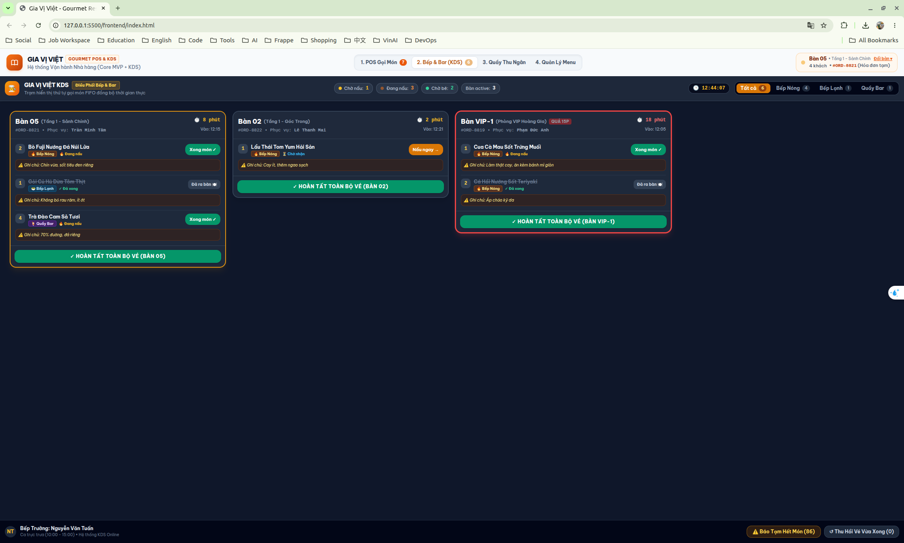

---

### 7.3. Cashier & Multi-Channel Billing View

Split-screen reconciliation with active table switcher, pre-bill thermal receipt preview, VIP customer loyalty discount, and multi-method payment (Cash change calculator, dynamic VietQR):

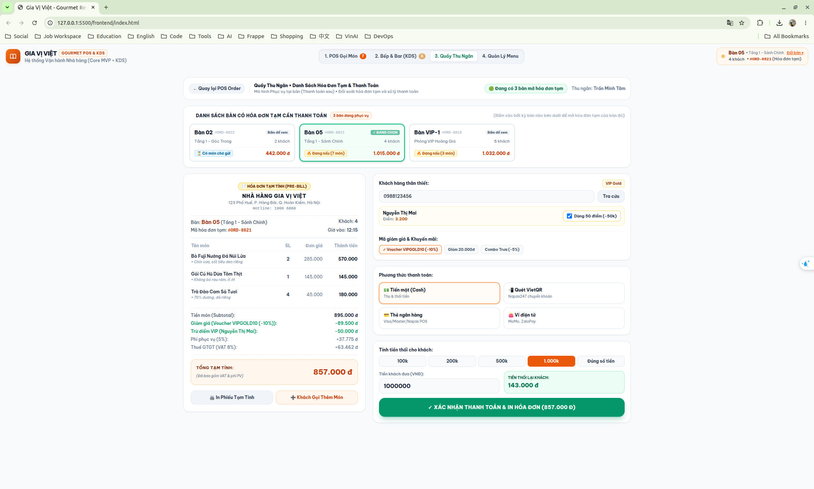

---

### 7.4. Menu Management & Margin Governance View

Centralized back-office dashboard displaying key financial metrics (Gross Margin %, shift revenue), catalog CRUD operations, and live stock synchronization across POS terminals:

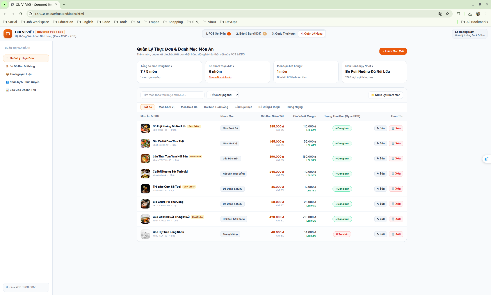

---

## 8. Software Architecture (C4 Model) & System Dynamics

The system architecture is engineered using the **C4 Model (Simon Brown)**, bridging static structural boundaries to dynamic behavioral execution across physical restaurant devices:

* **Level 1 - System Context**: Global boundary of ROMS Core System, 4 operational staff roles, and external satellite systems (VietQR Banking Gateway, 80mm ESC/POS Thermal Printer).
* **Level 2 - Containers**: Separates runtime boundaries across physical devices: **Waitstaff Mobile App** (handheld smartphones), **Staff Web App** (fullscreen kitchen KDS, desktop cashier POS, back-office admin), **API Gateway (Nginx)**, **Backend Web API (.NET 8)**, **SignalR Realtime Hub**, **PostgreSQL DB**, and **Media Storage**.
* **Level 3 - Components**: Decomposes the `.NET 8 Backend Web API` into 6 core cohesive components (`Tables`, `Orders`, `Invoices`, `Dishes`, `SignalR Hub`, `AppDbContext`).

<div align="center" style="background-color: #ffffff; padding: 24px; border-radius: 12px; border: 1px solid #e2e8f0; margin: 20px 0;">
  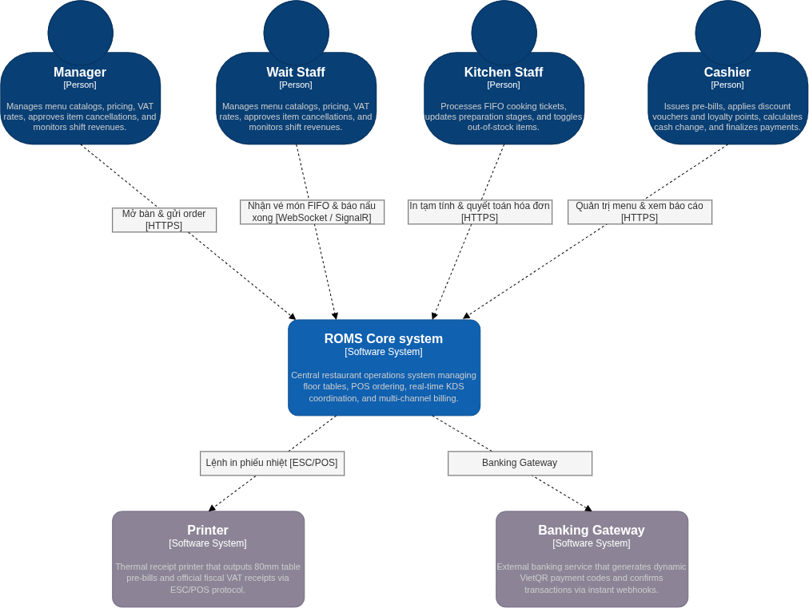
  <p style="margin-top: 10px; font-size: 13px; font-weight: 600; color: #475569; font-family: monospace;">Figure 8.1: C4 Level 1 - System Context Diagram</p>
</div>

<div align="center" style="background-color: #ffffff; padding: 24px; border-radius: 12px; border: 1px solid #e2e8f0; margin: 20px 0;">
  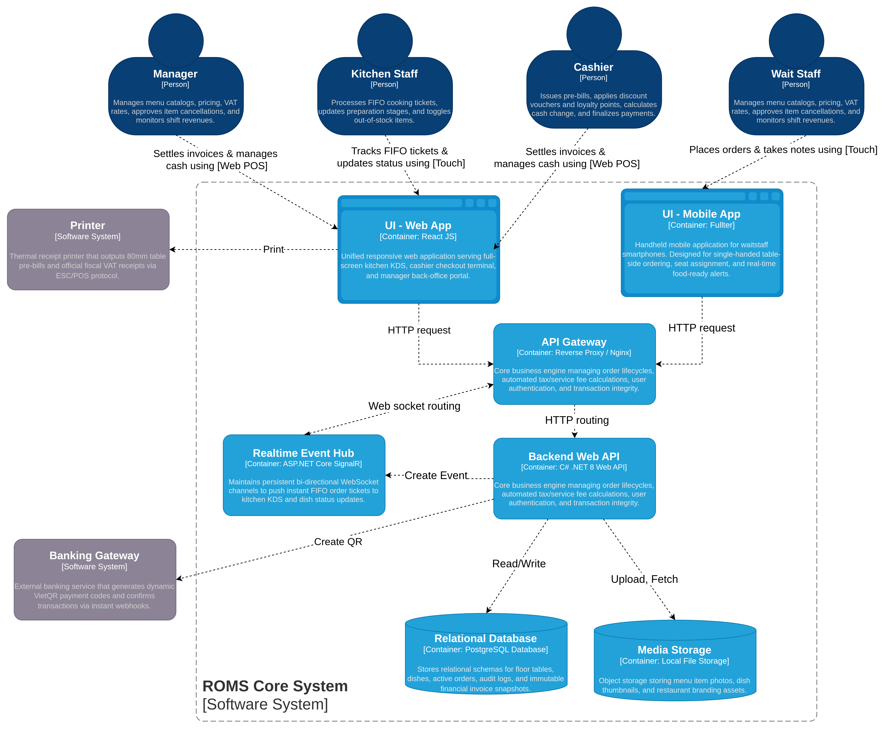
  <p style="margin-top: 10px; font-size: 13px; font-weight: 600; color: #475569; font-family: monospace;">Figure 8.2: C4 Level 2 - Container Diagram</p>
</div>

> 📄 **Technical Architecture Documentation**:
>
> * 📐 **C4 Architecture Specification (Levels 1, 2, 3)**: [`docs/c4-architecture.md`](docs/c4-architecture.md)
> * 🔄 **Dynamic Behavior, State Machines & Sequence Flows**: [`docs/behavioral-architecture.md`](docs/behavioral-architecture.md)
