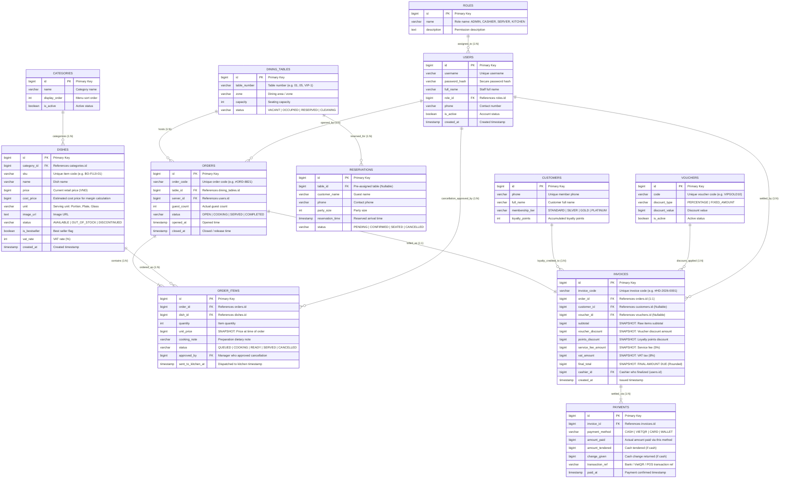

# Restaurant Operations Management System

## 1. Problem Statement & Objective


---

## 2. Feature Breakdown

Decomposed from the architecture mindmap (`docs/top-down-approach-mindmap.png`), the system comprises 5 functional modules:

```
                          ┌─ 1. Table & Reservation Management
                          ├─ 2. Order Management (POS)
Restaurant Operations ────┼─ 3. Kitchen Coordination (KDS)
      System              ├─ 4. Back Office & Menu Admin
                          └─ 5. Billing & Invoicing
```

| Module                                  | Core Scope                                                                                  |      Note      |
| :-------------------------------------- | :------------------------------------------------------------------------------------------ | :------------: |
| **1. Table & Reservation**        | Visual floor plan, table statuses, seating coordination, advance reservations               |                |
| **2. Order Taking (POS)**         | Fast dish catalog search, live cart, dietary notes, add-on order batches                    | **Core** |
| **3. Kitchen Coordination (KDS)** | Chronological FIFO tickets, station routing (Hot/Cold/Bar), cooking stages, 86 dish alert   |                |
| **4. Menu Management**            | Catalog hierarchy, pricing, VAT, cost margin, instant stock availability toggle             | **Core** |
| **5. Billing & Invoicing**        | Pre-bill calculation, vouchers, VIP points, multi-channel payment (Cash/VietQR/Card/Wallet) | **Core** |

---

## 3. Selected Core Features (Phase 1 MVP)

To resolve immediate operational bottlenecks with optimal resources, **3 mission-critical features** were selected:

### Feature 1: Menu Management

* **Catalog Hierarchy**: Categorizes F&B offerings (Appetizers, Mains, Hotpot, Drinks, Desserts).
* **Pricing & Tax**: Maintains retail prices, estimated cost prices (gross margin reporting), serving units, and VAT rate (8%).
* **Real-time Stock Toggling**: Kitchen and management can instantly toggle item availability (`Available` $\leftrightarrow$ `Out of Stock`), preventing front-of-house staff from ordering depleted dishes.

### Feature 2: Order Taking / POS

* **High-Speed Ordering**: Category filtering, instant SKU/name search, and quantity stepper adjustments `[- 1 +]`.
* **Custom Dietary Notes**: Attaches line-item cooking requests (*e.g., less spicy, no onion, sauce on the side*).
* **Pre-bill & Add-on Orders**: Supports multi-round ordering (`isAddon: true`) without resetting active cooking statuses of previously sent items.

### Feature 3: Billing & Invoicing

* **Automated Financial Calculation**: Automatically computes food subtotal, validates vouchers, deducts VIP loyalty points, adds 5% service fee, and applies 8% VAT.
* **Pre-Bill Printing**: Issues table-side pre-bills for guest verification prior to payment collection.
* **Multi-Channel Settlement**: Handles Cash (with automatic change calculator), dynamic VietQR transfer, bank card POS, and e-wallets.
* **Table Release**: Finalizes transactions, issues official VAT invoices, and resets tables to "Vacant".

---

## 4. Actor Roles & Use Case Diagrams

Derived from the functional breakdown, the system defines 4 internal user roles and 1 external supporting system:

* **👤 Waitstaff (Server)**: Table seating, table-side ordering, item dietary notes, KDS dispatch.
* **👨‍🍳 Kitchen / Bar Staff**: FIFO order queue processing, cooking stages progression, 86 (out-of-stock) alert.
* **💳 Cashier**: Pre-bill thermal printing, voucher & VIP point redemption, multi-channel payment reconciliation.
* **👔 Restaurant Manager / Admin**: Catalog maintenance, pricing/gross margin control, cancellation approval.
* **🏦 VietQR / Bank Gateway**: Dynamic QR generation and payment confirmation.

> 🌐 **Interactive Diagram Viewer**: Open [`docs/usecase-diagrams.html`](docs/usecase-diagrams.html) in any browser to inspect crisp vector SVG diagrams and switch seamlessly between English and Vietnamese.
> 📄 **Detailed Specifications**: See [`docs/usecase-diagram-en.md`](docs/usecase-diagram-en.md) (English) and [`docs/usecase-diagram.md`](docs/usecase-diagram.md) (Vietnamese).

---

### 4.1. System Context Overview

High-level architecture capturing interactions between the 4 primary actors and the core subsystem boundaries:


---

### 4.2. Server Use Case Diagram (Front-of-House Waitstaff)

Handles dining room floor management, guest reception, and table-side order taking:


* **Key Scopes**:
  * `UC-SRV-01`: View Floor Plan & Table Status (Visual color cues: Vacant / Occupied / Reserved).
  * `UC-SRV-02`: Open Table & Assign Guests (Activates dining session, generates Order ID).
  * `UC-SRV-03` & `UC-SRV-04`: Search Catalog, select dishes, and attach custom dietary cooking requests (*e.g., less spicy, no onion*).
  * `UC-SRV-05`: Dispatch Order to Kitchen (`<<include>>` item selection).
  * `UC-SRV-06`: Place subsequent Add-on Order batches without disrupting active cooking items.
  * `UC-SRV-07`: Request item cancellation (subject to manager approval).

---

### 4.3. Kitchen / Bar Staff Use Case Diagram (KDS Flow)

Operates on touch-enabled Kitchen Display Systems (KDS) for chronological culinary preparation:


* **Key Scopes**:
  * `UC-KIT-01`: View incoming tickets in strict First-In-First-Out (FIFO) chronological order.
  * `UC-KIT-02`: Filter active tickets by station specialization (Hot Kitchen / Cold Salad / Bar).
  * `UC-KIT-03`: Claim item preparation stage (`QUEUED` $\to$ `COOKING`).
  * `UC-KIT-04`: Mark finished dishes as ready (`COOKING` $\to$ `READY`) to notify service runners.
  * `UC-KIT-05`: Instant 86 (Out-of-Stock) alert switch to freeze depleted items across all POS terminals.

---

### 4.4. Cashier Staff Use Case Diagram (Billing & Settlement)

Manages pre-bill issue, discount validation, fiscal calculation, and table release:


* **Key Scopes**:
  * `UC-CSH-01`: View all active tables currently pending bill settlement.
  * `UC-CSH-02`: Issue 80mm thermal pre-bills for tableside guest verification.
  * `UC-CSH-03`: Apply promotional discount vouchers and VIP loyalty point redemption (`<<extend>>`).
  * `UC-CSH-04`: Process multi-channel payment (Cash with change calculator, dynamic VietQR, Card POS).
  * `UC-CSH-05`: Automated fiscal calculation (`<<include>>` 5% service fee + 8% VAT).
  * `UC-CSH-06`: Close transaction, issue official VAT invoice, and release table to `VACANT`.

---

### 4.5. Restaurant Manager / Admin Use Case Diagram (Back Office)

Provides centralized governance over menu engineering, loss-prevention controls, and business performance:


* **Key Scopes**:
  * `UC-MGR-01`: Menu catalog hierarchy maintenance (Categories, Dish CRUD, High-res images).
  * `UC-MGR-02`: Configure retail prices, estimated cost prices, and VAT rates.
  * `UC-MGR-03`: Review and approve/reject item cancellation requests initiated from floor staff.
  * `UC-MGR-04`: Real-time Gross Margin monitoring (`(Retail Price - Cost Price) / Retail Price`).
  * `UC-MGR-05`: Review shift revenues, payment channel breakdowns, and top-selling items.

---

## 5. Database Architecture & Detailed ERD

The database schema is engineered directly around the **3 Selected Core Features** with enterprise-grade data integrity:

* **Price Snapshot Pattern** (`order_items.unit_price`): Preserves historical transaction prices against future menu price updates.
* **Financial Immutability** (`invoices`): Locks immutable financial figures upon invoice creation.
* **Multi-Method Payments** (`invoices 1 : N payments`): Supports split billing and hybrid settlement (Cash + VietQR).



> 📄 **Schema Details**: For raw DBML definitions and documentation, see [`docs/schema.dbml`](docs/schema.dbml) and [`docs/database-erd.md`](docs/database-erd.md).

---

## 6. Interactive Frontend Prototype

The system includes a fully functional interactive prototype in [`frontend/`](frontend/):

1. **POS Order Taking**: Fast catalog search, table cart, add-on item tags, send-to-kitchen dispatch.
2. **Kitchen & Bar (KDS)**: FIFO ticket progression (`QUEUED` $\to$ `COOKING` $\to$ `READY` $\to$ `SERVED`), station filtering, out-of-stock quick 86.
3. **Cashier & Billing**: Active table pre-bill list, 1-click table switcher, pre-bill thermal printing, VietQR generation, cash change calculator.
4. **Menu Management**: Dish CRUD, cost/pricing editor, margin reporting, live stock toggle.

### How to Run

* Open [`frontend/index.html`](frontend/index.html) directly in any modern browser.
* Built with **Pure Vanilla JS + Tailwind CSS CDN** — zero build steps, zero dependencies.
