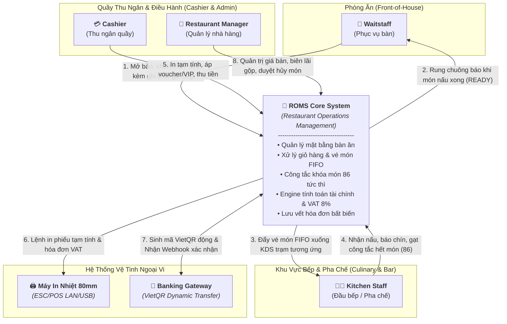
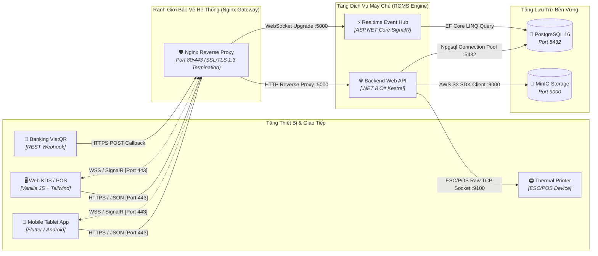
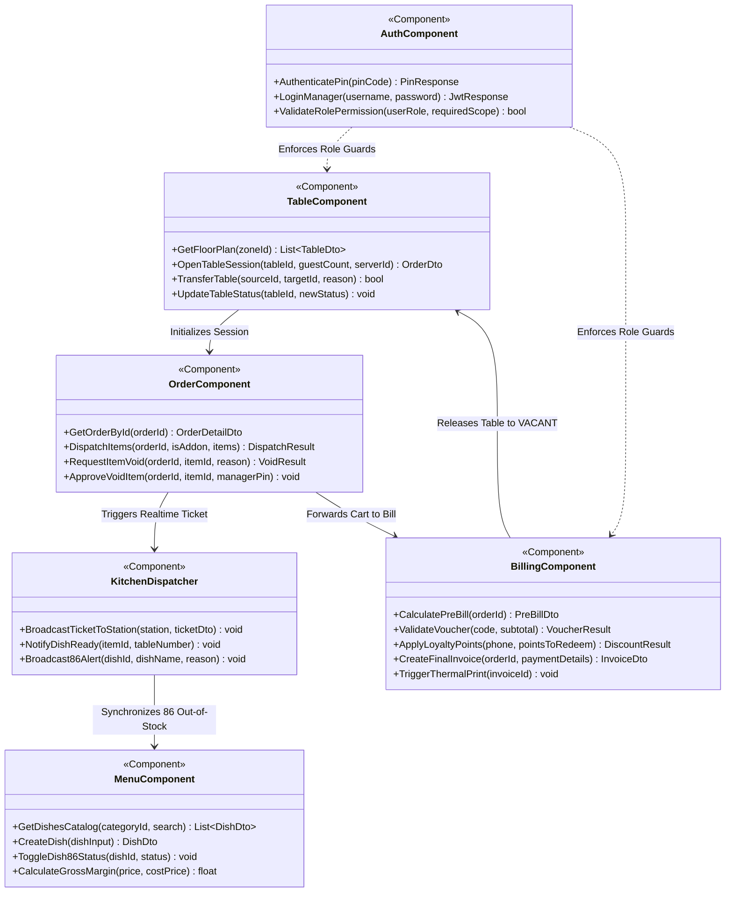
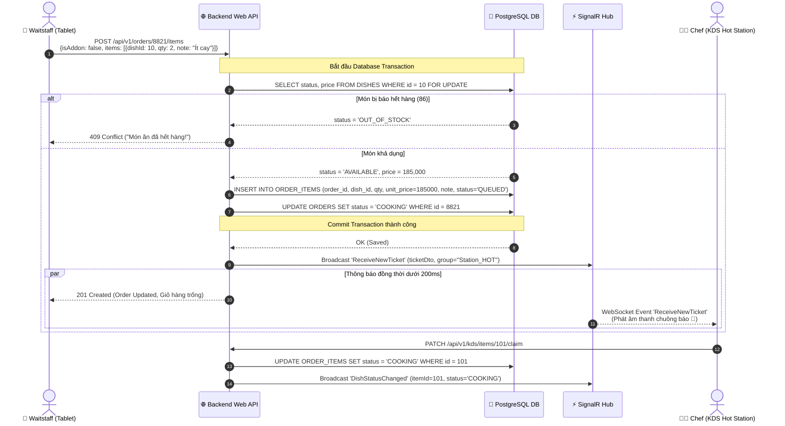
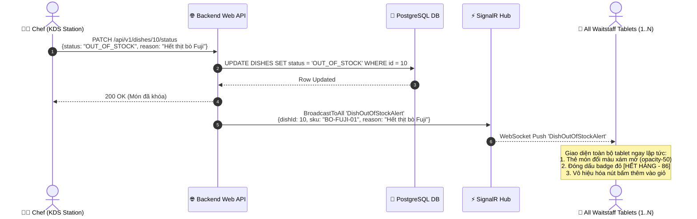
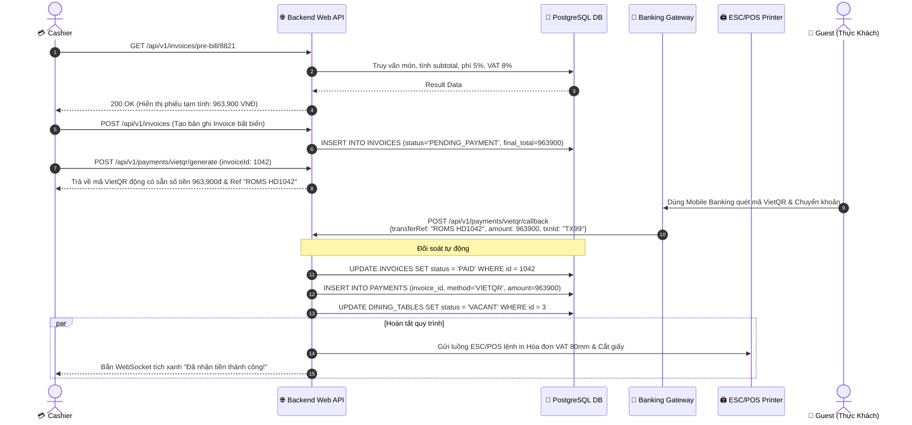
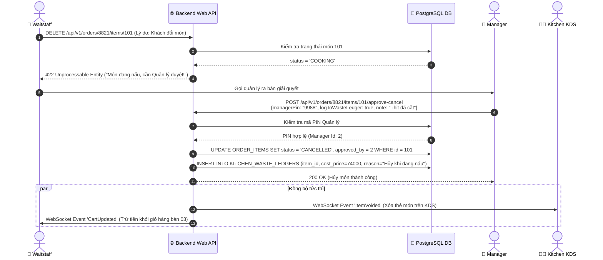
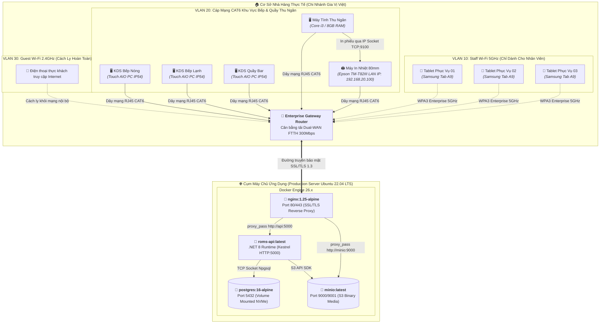

# Tài Liệu Kiến Trúc Phần Mềm Toàn Diện (arc42 Enterprise Architecture Specification)
## Hệ Thống Quản Lý Vận Hành Nhà Hàng (ROMS - Gia Vị Việt F&B)

> **Tiêu chuẩn áp dụng**: arc42 Template Version 9.0-EN (Tháng 7/2025)  
> **Tác giả tiêu chuẩn**: Dr. Peter Hruschka, Dr. Gernot Starke (<https://arc42.org>)  
> **Dự án**: Restaurant Operations Management System (ROMS)  
> **Phiên bản tài liệu**: 2.0.0 (Enterprise Comprehensive Edition)  
> **Phân loại bảo mật**: Nội bộ (Internal Engineering Specification)  
> **Ngày phê duyệt**: 14/09/2026  

---

## Mục Lục Chi Tiết
* [1. Introduction and Goals](#1-introduction-and-goals)
  * [1.1. Requirements Overview & Functional Scope](#11-requirements-overview--functional-scope)
  * [1.2. Quality Goals (Định Lượng Theo ISO/IEC 25010)](#12-quality-goals-%C4%91%E1%BB%8Bnh-l%C6%B0%E1%BB%A3ng-theo-isoiec-25010)
  * [1.3. Stakeholder Matrix](#13-stakeholder-matrix)
* [2. Architecture Constraints](#2-architecture-constraints)
  * [2.1. Ràng Buộc Kỹ Thuật & Phần Mềm (Technical Constraints)](#21-r%C3%A0ng-bu%E1%BB%99c-k%E1%BB%B9-thu%E1%BA%ADt--ph%E1%BA%A7n-m%E1%BB%81m-technical-constraints)
  * [2.2. Ràng Buộc Môi Trường Vật Lý & Phần Cứng F&B (Hardware Constraints)](#22-r%C3%A0ng-bu%E1%BB%99c-m%C3%B4i-tr%C6%B0%E1%BB%9Dng-v%E1%BA%ADt-l%C3%BD--ph%E1%BA%A7n-c%E1%BB%A9ng-fb-hardware-constraints)
  * [2.3. Ràng Buộc Pháp Lý, Thuế & Kế Toán (Organizational Constraints)](#23-r%C3%A0ng-bu%E1%BB%99c-ph%C3%A1p-l%C3%BD-thu%E1%BA%BF--k%E1%BA%BF-to%C3%A1n-organizational-constraints)
* [3. Context and Scope](#3-context-and-scope)
  * [3.1. Business Context (Bối Cảnh Nghiệp Vụ)](#31-business-context-b%E1%BB%91i-c%E1%BA%A3nh-nghi%E1%BB%87p-v%E1%BB%A5)
  * [3.2. Technical Context & Channel Mapping (Bối Cảnh Kỹ Thuật)](#32-technical-context--channel-mapping-b%E1%BB%91i-c%E1%BA%A3nh-k%E1%BB%B9-thu%E1%BA%ADt)
* [4. Solution Strategy](#4-solution-strategy)
  * [4.1. Quyết Định Kiến Trúc Trụ Cột (Fundamental Architectural Decisions)](#41-quy%E1%BA%BFt-%C4%91%E1%BB%8Bnh-ki%E1%BA%BFn-tr%C3%BAc-tr%E1%BB%A5-c%E1%BB%99t-fundamental-architectural-decisions)
  * [4.2. Ma Trận So Sánh Giải Pháp Kiến Trúc](#42-ma-tr%E1%BA%ADn-so-s%C3%A1nh-gi%E1%BA%A3i-ph%C3%A1p-ki%E1%BA%BFn-tr%C3%BAc)
* [5. Building Block View](#5-building-block-view)
  * [5.1. Level 1: Whitebox Overall System (C4 Level 1)](#51-level-1-whitebox-overall-system-c4-level-1)
  * [5.2. Level 2: Container Decomposition (C4 Level 2)](#52-level-2-container-decomposition-c4-level-2)
  * [5.3. Level 3: Component Breakdown (C4 Level 3)](#53-level-3-component-breakdown-c4-level-3)
  * [5.4. Database Building Blocks & Data Integrity Schema](#54-database-building-blocks--data-integrity-schema)
* [6. Runtime View](#6-runtime-view)
  * [6.1. Kịch Bản 1: Gọi Món Đợt Đầu & Bắn Vé Bếp FIFO Thời Gian Thực](#61-k%E1%BB%8Bch-b%E1%BA%A3n-1-g%E1%BB%8Di-m%C3%B3n-%C4%91%E1%BB%A3t-%C4%91%E1%BA%A7u--b%E1%BA%AFn-v%C3%A9-b%E1%BA%BFp-fifo-th%E1%BB%9Di-gian-th%E1%BB%B1c)
  * [6.2. Kịch Bản 2: Khóa Món Hết Hàng Tức Thì (86 Broadcast)](#62-k%E1%BB%8Bch-b%E1%BA%A3n-2-kh%C3%B3a-m%C3%B3n-h%E1%BA%BFt-h%C3%A0ng-t%E1%BB%A9c-th%C3%AC-86-broadcast)
  * [6.3. Kịch Bản 3: Quyết Toán VietQR Động & Webhook Ngân Hàng](#63-k%E1%BB%8Bch-b%E1%BA%A3n-3-quy%E1%BA%BFt-to%C3%A1n-vietqr-%C4%91%E1%BB%99ng--webhook-ng%C3%A2n-h%C3%A0ng)
  * [6.4. Kịch Bản 4: Quản Lý Phê Duyệt Hủy Món Đang Nấu & Ghi Nhận Hao Hụt Bếp](#64-k%E1%BB%8Bch-b%E1%BA%A3n-4-qu%E1%BA%A3n-l%C3%BD-ph%C3%AA-duy%E1%BB%87t-h%E1%BB%A7y-m%C3%B3n-%C4%91ang-n%E1%BA%A5u--ghi-nh%E1%BA%ADn-hao-h%E1%BB%A5t-b%E1%BA%BFp)
* [7. Deployment View](#7-deployment-view)
  * [7.1. Sơ Đồ Triển Khai Hạ Tầng & Phần Cứng (Deployment Topology)](#71-s%C6%A1-%C4%91%E1%BB%93-tri%E1%BB%83n-khai-h%E1%BA%A1-t%E1%BA%A7ng--ph%E1%BA%A7n-c%E1%BB%A9ng-deployment-topology)
  * [7.2. Đặc Tả Cấu Hình Môi Trường Docker Compose](#72-%C4%91%E1%BA%B7c-t%E1%BA%A3-c%E1%BA%A5u-h%C3%ACnh-m%C3%B4i-tr%C6%B0%E1%BB%9Dng-docker-compose)
  * [7.3. Cấu Trúc Mạng & Phân Vùng VLAN Nhà Hàng](#73-c%E1%BA%A5u-tr%C3%BAc-m%E1%BA%A1ng--ph%C3%A2n-v%C3%B9ng-vlan-nh%C3%A0-h%C3%A0ng)
* [8. Cross-cutting Concepts](#8-cross-cutting-concepts)
  * [8.1. Bảo Mật, Xác Thực & Kiểm Soát Truy Cập (Security Architecture)](#81-b%E1%BA%A3o-m%E1%BA%ADt-x%C3%A1c-th%E1%BB%B1c--ki%E1%BB%83m-so%C3%A1t-truy-c%E1%BA%ADp-security-architecture)
  * [8.2. Kiến Trúc Toàn Vẹn Dữ Liệu Tài Chính & Audit Trail](#82-ki%E1%BA%BFn-tr%C3%BAc-to%C3%A0n-v%E1%BB%87n-d%E1%BB%AF-li%E1%BB%87u-t%C3%A0i-ch%C3%ADnh--audit-trail)
  * [8.3. Giao Thức Điều Khiển Máy In Nhiệt 80mm ESC/POS](#83-giao-th%E1%BB%A9c-%C4%91i%E1%BB%81u-khi%E1%BB%83n-m%C3%A1y-in-nhi%E1%BB%87t-80mm-escpos)
  * [8.4. Chiến Lược Ghi Log, Quan Sát (Observability) & Báo Lỗi RFC 7807](#84-chi%E1%BA%BFn-l%C6%B0%E1%BB%A3c-ghi-log-quan-s%C3%A1t-observability--b%C3%A1o-l%E1%BB%97i-rfc-7807)
  * [8.5. Kiểm Soát Cạnh Tranh Dữ Liệu Đồng Thời (Concurrency Strategy)](#85-ki%E1%BB%83m-so%C3%A1t-c%E1%BA%A1nh-tranh-d%E1%BB%AF-li%E1%BB%87u-%C4%91%E1%BB%93ng-th%E1%BB%9Di-concurrency-strategy)
* [9. Architecture Decisions (ADRs)](#9-architecture-decisions-adrs)
* [10. Quality Requirements](#10-quality-requirements)
  * [10.1. Cây Thuộc Tính Chất Lượng (Quality Tree ISO/IEC 25010)](#101-c%C3%A2y-thu%E1%BB%99c-t%C3%ADnh-ch%E1%BA%A5t-l%C6%B0%E1%BB%A3ng-quality-tree-isoiec-25010)
  * [10.2. Kịch Bản Kiểm Thử Chất Lượng Định Lượng (Quality Scenarios)](#102-k%E1%BB%8Bch-b%E1%BA%A3n-ki%E1%BB%83m-th%E1%BB%AD-ch%E1%BA%A5t-l%C6%B0%E1%BB%A3ng-%C4%91%E1%BB%8Bnh-l%C6%B0%E1%BB%A3ng-quality-scenarios)
* [11. Risks and Technical Debts](#11-risks-and-technical-debts)
* [12. Glossary (Từ Điển Thuật Ngữ Nghiệp Vụ & Kỹ Thuật)](#12-glossary-t%E1%BB%AB-%C4%91i%E1%BB%83n-thu%E1%BA%ADt-ng%E1%BB%AF-nghi%E1%BB%87p-v%E1%BB%A5--k%E1%BB%B9-thu%E1%BA%ADt)

---

# 1. Introduction and Goals

## 1.1. Requirements Overview & Functional Scope
Hệ thống **ROMS (Restaurant Operations Management System)** là giải pháp phần mềm quản lý vận hành chuyên sâu cho chuỗi nhà hàng ẩm thực F&B (chuỗi thương hiệu Gia Vị Việt). Hệ thống xóa bỏ triệt để các rào cản vận hành truyền thống:
* Sai lệch đơn hàng do viết tay hoặc truyền miệng giữa sảnh ăn và bếp.
* Thất thoát doanh thu do nhân viên tự ý xóa món, sửa giá hoặc gian lận tiền mặt.
* Trễ nải thời gian chế biến món ăn do thiếu cơ chế điều phối vé thứ tự (FIFO) giữa các trạm bếp (Bếp Nóng, Bếp Lạnh, Quầy Bar).
* Chậm trễ trong khâu đối soát kế toán và thanh toán đa phương thức (Tiền mặt, VietQR động, Thẻ).

Dựa trên phương pháp phân rã Top-Down ([top-down-approach-mindmap.png](../assets/requirements/top-down-approach-mindmap.png)), hệ thống bao gồm 5 phân hệ lớn:
1. **Quản lý Bàn & Đặt Chỗ (Table & Reservation)**: Sơ đồ trực quan mặt bằng bàn, quản lý 5 trạng thái bàn (`VACANT`, `OCCUPIED`, `RESERVED`, `BILLING_PENDING`, `CLEANING`).
2. **Gọi Món Tại Bàn (POS Ordering - Core MVP)**: Tra cứu danh mục SKU siêu tốc, giỏ hàng cảm ứng, ghi chú chế biến và gọi món nhiều đợt (`isAddon: true`).
3. **Điều Phối Bếp & Bar (Kitchen KDS)**: Hàng đợi vé món FIFO, điều hướng trạm nấu chuyên biệt, chuyển đổi trạng thái chế biến (`QUEUED` $\to$ `COOKING` $\to$ `READY`) và khóa món hết hàng (86) tức thì.
4. **Quản Trị Thực Đơn & Biên Lợi Nhuận (Menu & Margin Admin - Core MVP)**: Phân cấp danh mục, quản lý giá bán lẻ, giá vốn dự toán (`cost_price`), tỷ suất lãi gộp (`Gross Margin %`), và thuế suất VAT (8%).
5. **Thu Ngân & Quyết Toán Hóa Đơn (Billing & Invoicing - Core MVP)**: Tự động tính phiếu tạm tính (Pre-bill), xác thực Voucher, tích điểm VIP, cộng 5% phí phục vụ, 8% VAT, sinh mã VietQR động theo chuẩn EMVCo và chốt hóa đơn tài chính bất biến.

## 1.2. Quality Goals (Định Lượng Theo ISO/IEC 25010)

| ID | Đặc tính chất lượng | Mục tiêu cụ thể | Chỉ số đo lường (SLA) | Cơ sở nghiệp vụ (Rationale) |
| :---: | :--- | :--- | :--- | :--- |
| **QG-1** | **Performance (Time Behavior)** | Độ trễ truyền vé món từ POS xuống KDS | $\le 200\text{ms}$ (Network + SignalR Hub broadcast) | Đảm bảo bếp nhận lệnh lập tức khi bồi bàn bấm gửi đơn trong giờ cao điểm. |
| **QG-2** | **Data Integrity (Accurateness)** | Độ chính xác tài chính & tính bất biến của Hóa đơn | Sai số làm tròn $= 0$ VNĐ; $100\%$ hóa đơn đã thanh toán không thể chỉnh sửa. | Ngăn chặn gian lận nội bộ, bảo đảm tính pháp lý kiểm toán thuế. |
| **QG-3** | **Availability (Fault Tolerance)** | Tính khả dụng trong khung giờ phục vụ khách | $\ge 99.9\%$ Uptime (10:00 - 23:00 hàng ngày) | Mất kết nối POS đồng nghĩa với việc toàn bộ quy trình bán hàng ngưng trệ. |
| **QG-4** | **Usability (Operability)** | Tốc độ nhân viên thao tác trên màn hình cảm ứng | Chọn 5 món & gửi bếp $\le 10$ giây; Quyết toán bill $\le 5$ giây | Giảm thiểu thời gian khách phải chờ đợi bồi bàn ghi chép tại bàn. |
| **QG-5** | **Concurrency (Reliability)** | Khả năng xử lý cạnh tranh giờ cao điểm | Chịu tải đồng thời $\ge 50$ phiên bàn mở cùng lúc không bị race condition | Tránh hiện tượng 2 bồi bàn cùng mở 1 bàn hoặc cùng đặt 1 suất ăn cuối cùng trong kho. |

## 1.3. Stakeholder Matrix

| Vai trò (Role) | Đại diện liên hệ | Trách nhiệm chính | Kỳ vọng đối với kiến trúc hệ thống |
| :--- | :--- | :--- | :--- |
| **👤 Waitstaff** | Nhân sự phục vụ bàn | Tiếp đón khách, mở bàn, ghi món tại bàn, bưng bê món khi chín. | Đăng nhập cực nhanh bằng mã PIN 1 giây, giỏ hàng mượt mà, điện thoại rung báo khi món chín. |
| **👨‍🍳 Kitchen Staff** | Bếp trưởng & Bar trưởng | Chế biến theo thứ tự FIFO, báo hoàn tất món, khóa món hết hàng (86). | Màn hình chữ to rõ ràng, âm báo to khi có vé mới, 1 chạm chuyển trạng thái món. |
| **💳 Cashier** | Thu ngân quầy trung tâm | In phiếu tạm tính, thu tiền mặt/thẻ/QR, bàn giao két tiền lúc hết ca. | Tự động tính tiền thừa, sinh mã VietQR động chuẩn xác, đối soát ca minh bạch. |
| **👔 Manager** | Quản lý nhà hàng | Cấu hình thực đơn, kiểm soát giá vốn/lãi gộp, duyệt hủy món đang nấu. | Báo cáo doanh thu ca real-time, kiểm soát hao hụt bếp chặt chẽ, duyệt hủy món có lưu vết PIN. |
| **👑 Director of Eng** | Ban Giám đốc Kỹ thuật | Phê duyệt thiết kế kiến trúc, lộ trình công nghệ và ngân sách phát triển. | Hệ thống chuẩn hóa C4/arc42, API Contract OpenAPI 3.0 rõ ràng, dễ bảo trì và mở rộng chuỗi. |
| **🏦 Banking Partner** | Đối tác Cổng VietQR | Sinh mã thanh toán QR ngân hàng và xác nhận dòng tiền qua Webhook. | Giao thức Webhook bảo mật, xác thực chữ ký số, xử lý Idempotency chống thanh toán lặp. |

---

# 2. Architecture Constraints

## 2.1. Ràng Buộc Kỹ Thuật & Phần Mềm (Technical Constraints)
1. **Nền tảng Backend**: Bắt buộc sử dụng **C# .NET 8 Web API** (LTS). Tận dụng tối đa kiến trúc bất đồng bộ `async/await`, cơ chế Dependency Injection nguyên bản và `Npgsql Entity Framework Core`.
2. **Cơ sở dữ liệu Quan hệ**: Sử dụng **PostgreSQL 16**. Toàn bộ các giao dịch tài chính (Tạo Order, Bổ sung món, Chốt Invoice, Lưu Payment) bắt buộc phải bọc trong Database Transactions với mức cô lập `Read Committed` hoặc `Serializable` chống xung đột.
3. **Kênh Thời Gian Thực**: Sử dụng **ASP.NET Core SignalR Core** trên nền WebSocket tiêu chuẩn, hỗ trợ tự động giáng cấp (fallback) sang Server-Sent Events (SSE) hoặc Long-Polling khi gặp tường lửa mạng hạn chế.
4. **Giao diện Người dùng (Frontend)**: Xây dựng bằng **Pure Vanilla JavaScript (ES6+) kết hợp Tailwind CSS CDN**. Tuyệt đối không dùng các framework đóng gói cồng kềnh (Node build-step) nhằm đảm bảo nạp trang nhanh tức thì trên các thiết bị cảm ứng cấu hình thấp.

## 2.2. Ràng Buộc Môi Trường Vật Lý & Phần Cứng F&B (Hardware Constraints)
1. **Thiết bị Quầy Thu Ngân (Cashier Station)**:
   * Máy in hóa đơn nhiệt khổ 80mm (Epson TM-T82III hoặc Xprinter XP-Q200) kết nối qua giao thức mạng `ESC/POS TCP Port 9100` hoặc cổng USB ảo (`/dev/usb/lp0`).
   * Ngăn kéo đựng tiền tự động (Cash Drawer) kích hoạt bằng xung điện 24V qua cổng RJ11 của máy in nhiệt khi xác nhận thu tiền mặt.
2. **Môi trường Bếp & Bar (Kitchen KDS)**:
   * Màn hình cảm ứng công nghiệp gắn tường (Touch All-in-One PC), chuẩn bảo vệ mặt kính chống ẩm và dầu mỡ tối thiểu IP54.
   * Nhiệt độ phòng bếp thường xuyên đạt $40^\circ\text{C} - 48^\circ\text{C}$ $\to$ Hệ thống phần mềm phải có giao diện nền đen (Dark Mode) giảm nhiệt tỏa ra từ màn hình và tăng độ tương phản nhìn từ khoảng cách 2 mét.
   * Bắt buộc kết nối bằng **dây cáp mạng LAN CAT6 chống nhiễu**, không dùng Wi-Fi trong khu vực bếp vì lò vi sóng và tường inox chắn sóng cực mạnh.
3. **Mạng Không Dây Phòng Ăn (Dining Area Wi-Fi)**:
   * Thiết bị cầm tay của phục vụ (Tablet Android/iPad) chạy bằng pin cả ngày, kết nối sóng Wi-Fi 5GHz riêng biệt. Hệ thống phải xử lý mượt mà kịch bản thiết bị đi vào "vùng lõm sóng" (Dead zones).

## 2.3. Ràng Buộc Pháp Lý, Thuế & Kế Toán (Organizational Constraints)
1. **Tuân thủ Nghị định 123/2020/NĐ-CP & Thông tư 78/2021/TT-BTC**:
   * Hóa đơn thanh toán phải lưu giữ đầy đủ các trường: Ký hiệu mẫu số, ký hiệu hóa đơn, số hóa đơn, ngày giờ phát hành, danh mục hàng hóa, đơn giá snapshot, tiền thuế VAT (8%), tổng tiền thanh toán và định danh thu ngân.
2. **Kiểm Soát Thất Thoát (Loss Prevention Governance)**:
   * Mọi yêu cầu hủy món ăn khi đã bắt đầu chế biến (`COOKING`) bắt buộc phải ghi nhận danh tính Quản lý phê duyệt (`approved_by`), lý do hủy và tự động hạch toán nguyên vật liệu vào **Sổ Hao Hụt Bếp (Kitchen Waste Ledger)** để trừ tồn kho định kỳ.

---

# 3. Context and Scope

## 3.1. Business Context (Bối Cảnh Nghiệp Vụ)



### Bảng Phân Tích Luồng Dữ Liệu Nghiệp Vụ Ngoại Vi:

| Tác nhân / Hệ thống | Dữ liệu Đầu vào (Input to ROMS) | Dữ liệu Đầu ra (Output from ROMS) | Mục đích nghiệp vụ |
| :--- | :--- | :--- | :--- |
| **Waitstaff (Phục vụ)** | Số bàn, số khách, món chọn, ghi chú khẩu vị, mã PIN. | Danh mục thực đơn, trạng thái bàn, thông báo món chín. | Khởi tạo phiên ăn, đưa yêu cầu của thực khách vào hệ thống. |
| **Kitchen (Đầu bếp)** | Bấm nhận món (`COOKING`), báo chín (`READY`), báo hết món (`OUT_OF_STOCK`). | Danh sách vé món FIFO phân trạm (Hot/Cold/Bar), chuông cảnh báo. | Điều phối nhịp nhàng các trạm chế biến, chặn khách gọi món đã cạn nguyên liệu. |
| **Cashier (Thu ngân)** | Mã bàn xin thanh toán, mã voucher, SĐT hội viên VIP, số tiền mặt khách trả. | Phiếu tạm tính (Pre-bill), hóa đơn VAT chính thức, số tiền thừa trả lại. | Quyết toán chính xác, minh bạch dòng tiền thực tế tại ca làm việc. |
| **Manager (Quản lý)** | Thông tin món mới, giá vốn, giá niêm yết, mã PIN duyệt hủy món đang nấu. | Báo cáo doanh thu ca, tỷ suất Gross Margin %, sổ hao hụt nguyên liệu bếp. | Giám sát hiệu quả tài chính, ngăn ngừa gian lận và thất thoát nguyên liệu. |
| **Máy in nhiệt 80mm** | Trạng thái máy in (Hết giấy, sẵn sàng). | Chuỗi lệnh nhị phân ESC/POS in hóa đơn, lệnh cắt giấy tự động. | Cung cấp chứng từ bản in vật lý cho khách hàng kiểm tra. |
| **Banking Gateway** | Webhook JSON xác nhận giao dịch chuyển tiền thành công khớp mã hóa đơn. | Yêu cầu sinh mã VietQR động kèm chính xác số tiền cần thu. | Tự động hóa quyết toán không dùng tiền mặt, giải phóng bàn tức thì khi tiền về tài khoản. |

## 3.2. Technical Context & Channel Mapping (Bối Cảnh Kỹ Thuật)



---

# 4. Solution Strategy

## 4.1. Quyết Định Kiến Trúc Trụ Cột (Fundamental Architectural Decisions)

1. **Kiến Trúc Modular Monolith (.NET 8 Web API)**:
   * **Bối cảnh**: Hệ thống phục vụ vận hành nhà hàng đòi hỏi tính toàn vẹn dữ liệu cực kỳ khắt khe (khi mở bàn, ghi order, bắn vé bếp, xuất hóa đơn đều liên quan chặt chẽ đến trạng thái bàn và tồn kho).
   * **Chiến lược**: Đóng gói toàn bộ 6 Component nghiệp vụ trong cùng một Solution .NET 8 duy nhất nhưng phân tách rõ ràng ranh giới Layer (Domain, Application, Infrastructure, API). Loại bỏ chi phí vận hành mạng phức tạp và lỗi phân tán (Distributed Transactions) của Microservices.
2. **Kênh Đẩy Thời Gian Thực Hai Chiều (Bi-directional Realtime Push)**:
   * **Bối cảnh**: Bếp không thể ngồi refresh trang hay chờ 5 giây polling để thấy món ăn mới; phục vụ cần biết ngay lập tức khi món ăn vừa nấu xong để ra bưng.
   * **Chiến lược**: Dùng SignalR Core Hub phân chia theo 6 Nhóm (Groups). Sự kiện đẩy từ server xuống client đạt độ trễ $\le 200\text{ms}$.
3. **Mẫu Thiết Kế Chụp Giá Bất Biến (Price Snapshot Pattern)**:
   * **Bối cảnh**: Giá thịt bò Fuji có thể tăng từ 180,000đ lên 200,000đ vào tuần sau. Nếu hệ thống chỉ lưu `dish_id` trong chi tiết đơn hàng, việc tính toán lại báo cáo doanh thu của tháng trước sẽ bị đội giá sai lệch hoàn toàn.
   * **Chiến lược**: Trường `order_items.unit_price` bắt buộc phải sao chép đơn giá bán tại đúng thời điểm gọi món. Toàn bộ số tiền tại `invoices` được khóa bất biến vĩnh viễn ngay khi đóng trạng thái `PAID`.
4. **Chiến Lược Xác Thực Phân Tầng Theo Ngữ Cảnh Hoạt Động (Contextual Dual-Auth)**:
   * Nhân viên phòng ăn: Dùng mã PIN 4 số nhanh gọn, mở máy trong 1 giây, tự động gán `server_id` vào mọi món gọi để tính KPI phục vụ.
   * Quản lý / Thu ngân: Dùng tài khoản cá nhân, mật khẩu mạnh và JWT Access Token (hạn 15 phút) để bảo vệ các thao tác sửa giá, xem doanh thu và mở két tiền.
5. **Thiết Kế Tối Giản Tầng Client (Zero-Build Vanilla Architecture)**:
   * Loại bỏ hoàn toàn các bước build phức tạp (Webpack, Vite) tại các màn hình vận hành quầy (KDS, Cashier). Mã nguồn HTML/JS thuần giúp trang web khởi động ngay lập tức, bộ nhớ RAM tiêu thụ dưới 50MB, hoạt động bền bỉ 24/7 trên các máy tính Kiosk nhúng.

## 4.2. Ma Trận So Sánh Giải Pháp Kiến Trúc

| Tiêu chí kỹ thuật | Giải pháp lựa chọn: Modular Monolith + SignalR | Giải pháp thay thế: Microservices + Polling | Lý do kiến trúc lựa chọn |
| :--- | :--- | :--- | :--- |
| **Độ trễ truyền vé bếp** | $\le 200\text{ms}$ (WebSocket Event Push tức thì) | $2000\text{ms} - 5000\text{ms}$ (Độ trễ chu kỳ Polling) | Loại bỏ độ trễ gây nguội món ăn hoặc ùn ứ bếp. |
| **Tải tài nguyên mạng/CPU** | Cực thấp (Chỉ gửi gói tin JSON nhỏ khi có sự kiện) | Rất cao ($10$ KDS $\times 30$ req/phút = 18,000 req rác/giờ) | Tiết kiệm băng thông đường truyền Internet của nhà hàng. |
| **Độ phức tạp giao dịch** | Đơn giản (ACID Database Transactions trong PostgreSQL) | Rất phức tạp (Saga Pattern, 2-Phase Commit, Outbox) | Đảm bảo tiền bạc không bao giờ bị lệch hoặc mất dữ liệu. |
| **Chi phí hạ tầng máy chủ** | Thấp (Chỉ cần 1 VPS Ubuntu 4 Core / 8GB RAM) | Cao (Cần cụm Kubernetes, Service Mesh, Kafka) | Tối ưu hóa tối đa chi phí cho giai đoạn khởi động dự án. |

---

# 5. Building Block View

## 5.1. Level 1: Whitebox Overall System (C4 Level 1)
Xem sơ đồ kiến trúc tổng thể [docs/assets/architecture/C1.png](../assets/architecture/C1.png) và đặc tả chi tiết tại [docs/02-architecture/c4-architecture.md](c4-architecture.md#1-c4-level-1-system-context-diagram-b%E1%BB%91i-c%E1%BA%A3nh-h%E1%BB%87-th%E1%BB%91ng).

## 5.2. Level 2: Container Decomposition (C4 Level 2)
Xem sơ đồ phân rã các Container thực thi độc lập [docs/assets/architecture/C2.png](../assets/architecture/C2.png) và đặc tả chi tiết tại [docs/02-architecture/c4-architecture.md](c4-architecture.md#2-c4-level-2-container-diagram-ki%E1%BA%BFn-tr%C3%BAc-c%C3%A1c-kh%E1%BB%91i-th%E1%BB%B1c-thi).

## 5.3. Level 3: Component Breakdown (C4 Level 3)
Phóng to khối xử lý lõi **Backend Web API (.NET 8)** thành 6 Component chuyên trách:



### Bảng Đặc Tả Chi Tiết 6 Components Tầng Backend:

| Component Name | Lớp Mã Nguồn Chính | Giao Diện Cung Cấp (Endpoints / Services) | Thành Phần Phụ Thuộc (Dependencies) |
| :--- | :--- | :--- | :--- |
| **Security & RBAC** | `JwtMiddleware.cs`, `AuthService.cs` | `POST /auth/login`, `POST /auth/pin`, `POST /auth/refresh` | `AppDbContext`, `IPasswordHasher` |
| **Table Management**| `TablesController.cs`, `TableService.cs` | `GET /tables`, `POST /tables/{id}/open`, `POST /tables/{id}/transfer` | `AppDbContext`, `RestaurantHub` |
| **Order Processing**| `OrdersController.cs`, `OrderService.cs` | `GET /orders/{id}`, `POST /orders/{id}/items`, `DELETE /orders/...` | `AppDbContext`, `KitchenDispatcher`, `MenuService` |
| **Kitchen Dispatcher**| `RestaurantHub.cs`, `KdsService.cs` | `GET /kds/tickets`, `PATCH /kds/items/{id}/claim`, WebSocket Push | `IHubContext<RestaurantHub>` |
| **Billing & Invoicing**| `InvoicesController.cs`, `BillingService.cs`| `GET /invoices/pre-bill/{id}`, `POST /invoices`, `POST /payments/...`| `AppDbContext`, `IEscPosPrinterService`, `VietQrClient`|
| **Menu Catalog** | `DishesController.cs`, `DishService.cs` | `GET /dishes`, `POST /dishes`, `PATCH /dishes/{id}/status` | `AppDbContext`, `IMediaStorageService`, `RestaurantHub` |

## 5.4. Database Building Blocks & Data Integrity Schema

Hệ thống thiết kế 11 bảng chuẩn hóa quan hệ toàn vẹn trong PostgreSQL:
* **Bảng Người dùng & Phân quyền**: `ROLES (1) ── (N) USERS`.
* **Bảng Thực đơn & Danh mục**: `CATEGORIES (1) ── (N) DISHES`.
* **Bảng Mặt bằng & Phiên ăn**: `DINING_TABLES (1) ── (N) ORDERS`, `DINING_TABLES (1) ── (N) RESERVATIONS`.
* **Bảng Chi tiết gọi món**: `ORDERS (1) ── (N) ORDER_ITEMS`, `DISHES (1) ── (N) ORDER_ITEMS`.
* **Bảng Hóa đơn & Quyết toán**: `ORDERS (1) ── (1) INVOICES`, `CUSTOMERS (1) ── (N) INVOICES`, `VOUCHERS (1) ── (N) INVOICES`.
* **Bảng Thanh toán đa kênh**: `INVOICES (1) ── (N) PAYMENTS`.

```
[Bảng DISHES]                    [Bảng ORDER_ITEMS]                   [Bảng INVOICES]
price: 185,000đ  ───────────►   unit_price: 185,000đ (Snapshot) ──►   subtotal: 370,000đ
cost_price: 74,000đ             status: QUEUED/COOKING/READY          service_fee: 18,500đ (5%)
status: AVAILABLE                                                     vat_amount: 31,080đ (8%)
                                                                      final_total: 419,580đ (SEALED)
```
*(Chi tiết mã lệnh DBML xem tại [docs/03-database/schema.dbml](../03-database/schema.dbml))*.

---

# 6. Runtime View

## 6.1. Kịch Bản 1: Gọi Món Đợt Đầu & Bắn Vé Bếp FIFO Thời Gian Thực



## 6.2. Kịch Bản 2: Khóa Món Hết Hàng Tức Thì (86 Broadcast)



## 6.3. Kịch Bản 3: Quyết Toán VietQR Động & Webhook Ngân Hàng



## 6.4. Kịch Bản 4: Quản Lý Phê Duyệt Hủy Món Đang Nấu & Ghi Nhận Hao Hụt Bếp



---

# 7. Deployment View

## 7.1. Sơ Đồ Triển Khai Hạ Tầng & Phần Cứng (Deployment Topology)



## 7.2. Đặc Tả Cấu Hình Môi Trường Docker Compose

Dự án được đóng gói trọn gói bằng tệp `docker-compose.yml` phục vụ triển khai tự động:

```yaml
version: '3.8'

services:
  nginx:
    image: nginx:1.25-alpine
    container_name: roms-nginx
    restart: always
    ports:
      - "80:80"
      - "443:443"
    volumes:
      - ./nginx/nginx.conf:/etc/nginx/nginx.conf:ro
      - ./nginx/ssl:/etc/nginx/ssl:ro
    depends_on:
      - api

  api:
    build:
      context: .
      dockerfile: Dockerfile
    container_name: roms-api
    restart: always
    environment:
      - ASPNETCORE_ENVIRONMENT=Production
      - ConnectionStrings__DefaultConnection=Host=postgres;Port=5432;Database=roms_db;Username=roms_admin;Password=${DB_PASSWORD};
      - Jwt__SecretKey=${JWT_SECRET}
      - Minio__Endpoint=minio:9000
    depends_on:
      postgres:
        condition: service_healthy

  postgres:
    image: postgres:16-alpine
    container_name: roms-postgres
    restart: always
    environment:
      POSTGRES_DB: roms_db
      POSTGRES_USER: roms_admin
      POSTGRES_PASSWORD: ${DB_PASSWORD}
    volumes:
      - pgdata:/var/lib/postgresql/data
      - ./init-db.sql:/docker-entrypoint-initdb.d/init.sql
    healthcheck:
      test: ["CMD-SHELL", "pg_isready -U roms_admin -d roms_db"]
      interval: 5s
      timeout: 5s
      retries: 5

  minio:
    image: minio/minio:latest
    container_name: roms-minio
    restart: always
    command: server /data --console-address ":9001"
    environment:
      MINIO_ROOT_USER: ${MINIO_ROOT_USER}
      MINIO_ROOT_PASSWORD: ${MINIO_ROOT_PASSWORD}
    volumes:
      - miniodata:/data

volumes:
  pgdata:
  miniodata:
```

## 7.3. Cấu Trúc Mạng & Phân Vùng VLAN Nhà Hàng

* **VLAN 10 (`192.168.10.0/24`) - Staff Mobile Wi-Fi**: Chỉ thiết bị tablet có gán địa chỉ MAC hợp lệ mới được cấp phát DHCP; ưu tiên QoS băng thông cao nhất cho luồng SignalR.
* **VLAN 20 (`192.168.20.0/24`) - Kitchen & Cashier Hardwired**: Toàn bộ máy POS, màn hình KDS và máy in hóa đơn nhiệt đặt IP tĩnh (`192.168.20.100` cho máy in). Cấm tuyệt đối truy cập Internet ra ngoài, chỉ giao tiếp nội bộ tới API Gateway.
* **VLAN 30 (`192.168.30.0/24`) - Guest Wi-Fi**: Cung cấp mạng internet cho thực khách lướt web, có tính năng cách ly client (`Client Isolation`) chống quét cổng (port scan) vào hệ thống nội bộ nhà hàng.

---

# 8. Cross-cutting Concepts

## 8.1. Bảo Mật, Xác Thực & Kiểm Soát Truy Cập (Security Architecture)

### Ma Trận Phân Quyền Vai Trò (RBAC Matrix):

| Nhóm chức năng / Use Case | Waitstaff (`SERVER`) | Kitchen (`KITCHEN`) | Cashier (`CASHIER`) | Manager (`MANAGER`) |
| :--- | :---: | :---: | :---: | :---: |
| Mở bàn / Chuyển bàn / Gộp bàn | ✅ Có quyền | ❌ Chặn | ❌ Chặn | ✅ Toàn quyền |
| Chọn món & Gửi vé xuống bếp | ✅ Có quyền | ❌ Chặn | ❌ Chặn | ✅ Toàn quyền |
| Nhận nấu (`claim`) & Báo món chín (`ready`) | ❌ Chặn | ✅ Có quyền | ❌ Chặn | ✅ Toàn quyền |
| Gạt công tắc khóa món hết hàng (86) | ❌ Chặn | ✅ Có quyền | ❌ Chặn | ✅ Toàn quyền |
| In phiếu tạm tính 80mm | ✅ Được xem | ❌ Chặn | ✅ Có quyền in | ✅ Toàn quyền in |
| Áp mã Voucher & Trừ điểm VIP | ❌ Chặn | ❌ Chặn | ✅ Có quyền | ✅ Toàn quyền |
| Chốt Hóa đơn & Nhận tiền mặt/VietQR | ❌ Chặn | ❌ Chặn | ✅ Có quyền | ✅ Toàn quyền |
| Phê duyệt hủy món đang nấu (`COOKING`) | ❌ Chặn | ❌ Chặn | ❌ Chặn | 🔑 **Bắt buộc PIN** |
| Thay đổi giá bán & Cấu hình menu | ❌ Chặn | ❌ Chặn | ❌ Chặn | 🔑 **Bắt buộc JWT** |
| Xem báo cáo doanh thu ca & Lợi nhuận gộp | ❌ Chặn | ❌ Chặn | ❌ Chặn | 🔑 **Bắt buộc JWT** |

## 8.2. Kiến Trúc Toàn Vẹn Dữ Liệu Tài Chính & Audit Trail

1. **Công thức Tài Chính Bất Biến 1 Chiều**:
   $$\text{Subtotal} = \sum_{i=1}^{n} (\text{order\_items.quantity}_i \times \text{order\_items.unit\_price}_i)$$
   $$\text{Discounted Subtotal} = \text{Subtotal} - \text{Voucher Discount} - \text{Points Discount}$$
   $$\text{Service Fee (5\%)} = \text{Round}(\text{Discounted Subtotal} \times 0.05)$$
   $$\text{VAT (8\%)} = \text{Round}((\text{Discounted Subtotal} + \text{Service Fee}) \times 0.08)$$
   $$\text{Final Total} = \text{Discounted Subtotal} + \text{Service Fee} + \text{VAT}$$
2. **Quy tắc làm tròn tiền Việt Nam (VND Rounding)**:
   * Toàn bộ số tiền cuối cùng được làm tròn đến hàng trăm đồng theo chuẩn giao dịch ngân hàng: `Math.Round(amount / 100.0) * 100`.
3. **Audit Trail (Sổ Nhật Ký Kế Toán)**:
   * Mọi hành động nhạy cảm đều sinh bản ghi bất biến trong bảng nhật ký hệ thống: Ai thực hiện, mã máy POS, thời điểm chính xác (miligiây), số tiền chênh lệch và lý do.

## 8.3. Giao Thức Điều Khiển Máy In Nhiệt 80mm ESC/POS

Tầng backend giao tiếp trực tiếp với máy in hóa đơn nhiệt qua luồng nhị phân TCP Socket không qua driver trung gian:
* Khổ giấy: 80mm $\leftrightarrow$ $48$ ký tự văn bản chuẩn Font A ($12 \times 24$ dots).
* Mã điều khiển nhị phân thông dụng:
  * `0x1B 0x40` (Initialize Printer / Reset trạng thái).
  * `0x1B 0x61 0x01` (Căn lề giữa cho Header và Mã QR).
  * `0x1D 0x21 0x11` (Bật chữ phóng to gấp đôi cho Tổng tiền cần trả).
  * `0x1D 0x56 0x41 0x00` (Cắt giấy tự động hoàn toàn).
  * `0x1B 0x70 0x00 0x19 0xFA` (Bắn xung điện kích mở ngăn kéo đựng tiền mặt).

## 8.4. Chiến Lược Ghi Log, Quan Sát (Observability) & Báo Lỗi RFC 7807

* **Ghi Log cấu trúc (Structured Logging)**: Sử dụng thư viện `Serilog` ghi ra định dạng JSON bao gồm: `TraceId`, `UserId`, `OrderId`, `ExecutionTimeMs`.
* **Quy chuẩn mã lỗi API**: Toàn bộ các phản hồi HTTP status $4\text{xx}$ và $5\text{xx}$ bắt buộc trả về theo chuẩn RFC 7807:
```json
{
  "type": "https://api.giaviviet.vn/errors/out-of-stock",
  "title": "Conflict - Dish Unavailable",
  "status": 409,
  "detail": "Món ăn 'Bò Fuji Áp Chảo' vừa được Bếp trưởng đánh dấu hết hàng (86).",
  "instance": "/api/v1/orders/8821/items",
  "errorCode": "DISH_OUT_OF_STOCK_86",
  "timestamp": "2026-09-14T14:45:00Z"
}
```

## 8.5. Kiểm Soát Cạnh Tranh Dữ Liệu Đồng Thời (Concurrency Strategy)

* **Khi chọn món tồn kho hữu hạn**: Sử dụng khóa hàng CSDL bi quan (Pessimistic Row-level Locking) với câu lệnh `SELECT ... FOR UPDATE` trên bảng `dishes`.
* **Khi cập nhật trạng thái bàn**: Sử dụng khóa lạc quan (Optimistic Concurrency) với trường `xmin` trong PostgreSQL (hoặc trường `RowVersion`). Nếu 2 bồi bàn cùng mở 1 bàn trống tại cùng một thời điểm, bồi bàn bấm sau sẽ nhận mã lỗi `409 Table Already Occupied` và tự động làm mới giao diện.

---

# 9. Architecture Decisions (ADRs)

Dưới đây là 5 bản ghi quyết định kiến trúc then chốt theo định dạng chuẩn Michael Nygard:

### ADR-001: Áp Dụng Mẫu Price Snapshot Pattern Cho Bảng Order Items & Invoices
* **Trạng thái**: Đã phê duyệt & Đã hiện thực hóa (Accepted).
* **Bối cảnh**: Nhà hàng F&B liên tục cập nhật menu, thay đổi giá món ăn theo mùa vụ hoặc chương trình giờ vàng. Nếu hệ thống chỉ tham chiếu `dish_id` sang bảng `dishes` để lấy giá, việc quản lý thay đổi giá bán lẻ sẽ làm sai lệch toàn bộ doanh thu của các đơn hàng trong quá khứ khi kết xuất báo cáo thuế.
* **Quyết định**: Bảng `order_items` lưu cứng trường `unit_price` tại thời điểm gửi bếp. Bảng `invoices` đóng băng toàn bộ số tiền `subtotal`, `voucher_discount`, `points_discount`, `service_fee_amount`, `vat_amount`, `final_total` dưới dạng bất biến (Immutable).
* **Hệ quả tích cực**: Bảo toàn 100% tính toàn vẹn dữ liệu tài chính lịch sử, tốc độ truy vấn hóa đơn siêu nhanh không cần tính toán lại.
* **Hệ quả tiêu cực**: Tốn thêm khoảng 24 bytes cho mỗi bản ghi chi tiết đơn hàng (hoàn toàn chấp nhận được).

---

### ADR-002: Sử Dụng ASP.NET Core SignalR Core Cho Hệ Thống KDS Thay Vì HTTP Polling
* **Trạng thái**: Đã phê duyệt & Đã hiện thực hóa (Accepted).
* **Bối cảnh**: Màn hình KDS khu bếp và quầy pha chế đòi hỏi phải hiển thị vé món mới ngay khi phục vụ bấm nút tại bàn ăn. Nếu dùng kỹ thuật HTTP Polling (ví dụ: client gửi request mỗi 2 giây/lần), một nhà hàng 20 thiết bị sẽ tạo ra hàng chục nghìn request rác mỗi giờ làm hao mòn tài nguyên máy chủ.
* **Quyết định**: Triển khai WebSocket Hub thông qua ASP.NET Core SignalR, gom nhóm Client theo trạm (`Station_HOT`, `Station_COLD`, `Station_BAR`, `Floor_Waitstaff`).
* **Hệ quả tích cực**: Độ trễ nhận vé món giảm từ 2000ms xuống dưới 200ms; lượng request HTTP giảm hơn 95%; bếp nhận được âm thanh chuông báo tức thì.
* **Hệ quả tiêu cực**: Cần cấu hình reverse proxy Nginx hỗ trợ nâng cấp kết nối WebSocket (`Upgrade: websocket`) và cơ chế duy trì nhịp tim kết nối (Heartbeat).

---

### ADR-003: Chiến Lược Xác Thực Phân Tầng: Mã PIN Nhanh Cho Phục Vụ & JWT Cho Quản Lý
* **Trạng thái**: Đã phê duyệt & Đã hiện thực hóa (Accepted).
* **Bối cảnh**: Nhân viên phục vụ sảnh di chuyển liên tục giữa các bàn ăn, tay có thể ướt hoặc cầm khay bưng bê. Việc bắt nhân viên đăng nhập bằng Username/Mật khẩu dài kèm ký tự hoa/thường mỗi lần chạm máy là hoàn toàn bất khả thi trong thực tế F&B.
* **Quyết định**: Thiết kế bàn phím số cảm ứng lớn cho phép nhân viên nhập mã PIN cá nhân 4-6 số để kích hoạt phiên làm việc trong 1 giây. Các tài khoản Quản lý và Thu ngân vẫn bắt buộc đăng nhập tài khoản chuẩn mật khẩu mạnh và cấp phát JWT Token.
* **Hệ quả tích cực**: Tối ưu hóa tối đa năng suất lao động của bồi bàn; vẫn đảm bảo định danh chính xác `server_id` vào từng đơn hàng.
* **Hệ quả tiêu cực**: Mã PIN ngắn có nguy cơ bị nhìn trộm nếu nhân viên đứng quá sát nhau (giảm thiểu bằng cách tự động che dấu hoa thị `••••`).

---

### ADR-004: Lựa Chọn Kiến Trúc Modular Monolith Cho Giai Đoạn 1 (Phase 1 MVP)
* **Trạng thái**: Đã phê duyệt & Đã hiện thực hóa (Accepted).
* **Bối cảnh**: Đội ngũ phát triển cần đưa hệ thống vào vận hành thử nghiệm tại nhà hàng trong thời gian sớm nhất với nguồn lực hạ tầng tinh gọn.
* **Quyết định**: Không chia nhỏ hệ thống thành nhiều Microservices độc lập. Thay vào đó, xây dựng một khối Modular Monolith duy nhất trong .NET 8, phân tách ranh giới module rõ ràng bằng các C4 Components (`Tables`, `Orders`, `Dishes`, `Invoices`, `SignalR`).
* **Hệ quả tích cực**: Dễ kiểm thử, dễ debug cục bộ, triển khai 1-click bằng Docker Compose, toàn bộ giao dịch tiền tệ được đảm bảo ACID trong một database PostgreSQL duy nhất.
* **Hệ quả tiêu cực**: Nếu một module bị lỗi sập nghiêm trọng (crash tiến trình), toàn bộ API có thể bị ảnh hưởng (giảm thiểu bằng cơ chế Global Exception Handler Middleware).

---

### ADR-005: Xây Dựng Tầng Giao Diện POS/KDS Bằng Vanilla JavaScript Không Dùng Build-Step
* **Trạng thái**: Đã phê duyệt & Đã hiện thực hóa (Accepted).
* **Bối cảnh**: Các máy tính bảng Android giá rẻ hoặc màn hình Kiosk cảm ứng tại nhà hàng thường có dung lượng RAM thấp (2GB - 3GB) và CPU yếu. Các ứng dụng web đóng gói nặng nề bằng React/Angular sau thời gian chạy lâu thường bị tràn bộ nhớ (Memory Leak) và đơ cảm ứng.
* **Quyết định**: Xây dựng toàn bộ giao diện prototype vận hành bằng Pure Vanilla JS + Tailwind CSS qua CDN.
* **Hệ quả tích cực**: Kích thước tải trang siêu nhẹ (< 150KB), mở file chạy ngay lập tức không cần cài Node.js, không sợ xung đột dependency.
* **Hệ quả tiêu cực**: Khó tái sử dụng component phức tạp nếu quy mô màn hình tăng lên hàng trăm view (ở giai đoạn Phase 2 có thể nâng cấp lên Vue.js hoặc Flutter khi cần).

---

# 10. Quality Requirements

## 10.1. Cây Thuộc Tính Chất Lượng (Quality Tree ISO/IEC 25010)

```
CHẤT LƯỢNG TOÀN DIỆN HỆ THỐNG ROMS
├── ⚡ 1. Hiệu Năng Vận Hành (Performance Efficiency)
│   ├── [1.1] Độ trễ phân phối vé bếp KDS (Latency ≤ 200ms)
│   ├── [1.2] Thời gian sinh mã VietQR động (QR Generation ≤ 150ms)
│   └── [1.3] Thời gian khởi tạo đơn hàng mới (Order Init ≤ 80ms)
│
├── 🛡️ 2. An Toàn & Toàn Vẹn Dữ Liệu (Security & Integrity)
│   ├── [2.1] Tính bất biến số liệu hóa đơn đã chốt (Immutability 100%)
│   ├── [2.2] Kiểm soát thất thoát hủy món bếp (Audited Waste Logging 100%)
│   └── [2.3] Bảo vệ mã PIN nhân viên (Hashed with PBKDF2/SHA256)
│
├── 🔄 3. Độ Tin Cậy & Khả Năng Phục Hồi (Reliability & Resilience)
│   ├── [3.1] Khả năng tự kết nối lại khi mất Wi-Fi (Auto-reconnect Backoff)
│   ├── [3.2] Chống bán quá số lượng kho (Strict Concurrency Row-locking)
│   └── [3.3] Thời gian phục hồi máy chủ sau sự cố (MTTR < 2 phút)
│
└── 👥 4. Công Thái Học Vận Hành (Ergonomics & Usability)
    ├── [4.1] Tốc độ hoàn tất thao tác gọi món của bồi bàn (≤ 10 giây/đơn)
    └── [4.2] Khả năng nhận diện thị giác tại khu bếp (Tương phản cao từ cự ly 2 mét)
```

## 10.2. Kịch Bản Kiểm Thử Chất Lượng Định Lượng (Quality Scenarios)

| Mã kịch bản | Thuộc tính | Tác nhân & Kích thích (Stimulus) | Môi trường | Hành vi hệ thống & Tiêu chuẩn nghiệm thu định lượng (Response Measure) |
| :---: | :--- | :--- | :--- | :--- |
| **QS-01** | Performance | Phục vụ bấm nút **"Gửi Bếp"** cho đơn ăn gồm 6 món khác nhau. | Mạng Wi-Fi bình thường, hệ thống đang phục vụ 35 bàn. | Vé món xuất hiện trên màn hình KDS đúng trạm, chuông kêu reo; tổng thời gian đo từ lúc bấm tới lúc màn hình KDS render $\le 180\text{ms}$. |
| **QS-02** | Integrity | Quản lý thay đổi giá bán món "Lẩu Cá Tầm" từ 450,000đ lên 500,000đ lúc 19:45. | Khách tại Bàn 08 đã gọi món lẩu này lúc 19:30 và chưa thanh toán. | Khi in tạm tính lúc 20:30, đơn giá của món lẩu tại Bàn 08 vẫn giữ chính xác 450,000đ theo snapshot lúc gọi; sai lệch doanh thu bằng $0$ VNĐ. |
| **QS-03** | Concurrency | 2 bồi bàn tại 2 bàn khác nhau cùng lúc bấm gọi suất "Bò Nướng Đặc Biệt" cuối cùng còn lại. | Giờ cao điểm, kho báo chỉ còn đúng 1 suất. | Database kích hoạt khóa hàng bi quan: Bồi bàn A bấm trước (chênh lệch 30ms) đặt hàng thành công; Bồi bàn B nhận thông báo lỗi màu đỏ *"Món vừa hết hàng (86), vui lòng tư vấn món khác"*; không xảy ra bán âm kho. |
| **QS-04** | Resilience | Thiết bị tablet của phục vụ bị mất sóng Wi-Fi trong 45 giây khi nhân viên di chuyển vào góc khuất. | Phục vụ đang chọn dở 4 món ăn trong giỏ hàng. | Ứng dụng không bị crash, hiển thị thanh cảnh báo vàng *"Đang kết nối lại..."*; khi sóng Wi-Fi có lại, kết nối SignalR tự động phục hồi và dữ liệu giỏ hàng được bảo lưu nguyên vẹn 100%. |
| **QS-05** | Auditability | Bồi bàn yêu cầu hủy 1 món "Cơm Chiên Hải Sản" khi màn hình bếp đã chuyển sang màu cam `COOKING`. | Khách giục lâu và hủy đơn. | Hệ thống chặn lệnh xóa; yêu cầu Quản lý nhập mã PIN 4 số xác nhận; tự động ghi 1 dòng vào bảng `kitchen_waste_ledgers` với đơn giá vốn 35,000đ để đối soát thất thoát cuối tháng. |
| **QS-06** | Usability | Đầu bếp tay dính dầu mỡ thao tác trên màn hình KDS cảm ứng ở cự ly đứng nấu 1.5 mét. | Ánh sáng vàng khu bếp, nhiệt độ $42^\circ\text{C}$. | Giao diện nền đen (#0f172a), phông chữ Sans-serif đậm kích thước tối thiểu 18px, nút bấm cảm ứng kích thước $\ge 60\text{px} \times 60\text{px}$ giúp đầu bếp bấm chính xác 1 chạm không trượt. |

---

# 11. Risks and Technical Debts

## 11.1. Ma Trận Đánh Giá Rủi Ro Vận Hành & Phương Án Giảm Thiểu (Risk Matrix)

```
MỨC ĐỘ ẢNH HƯỞNG (IMPACT)
    ▲
Cao │         [R-02: Kẹt Máy In]        [R-01: Rớt Wi-Fi Phòng Ăn]
    │                                   [R-03: Tranh Chấp Kho 86]
    │
TB  │         [TD-01: Frontend Mock]
    │
Thấp│
    └────────────────────────────────────────────────────────►
              Thấp                     Trung Bình                 Cao
                             XÁC SUẤT XẢY RA (PROBABILITY)
```

| Mã rủi ro | Mô tả chi tiết rủi ro | Xác suất | Tác động | Giải pháp kiến trúc phòng ngừa & Giảm thiểu (Mitigation Strategy) |
| :---: | :--- | :---: | :---: | :--- |
| **R-01** | **Mạng Wi-Fi phòng ăn chập chờn / Mất kết nối giờ cao điểm** | Cao | Nghiêm trọng | • Thiết lập SSID riêng biệt băng tần 5GHz có giới hạn thiết bị MAC cho nhân viên.<br>• Tích hợp thư viện SignalR với cấu hình `AutomaticReconnect` với cơ chế Exponential Backoff.<br>• Lưu trữ giỏ hàng tạm thời tại `localStorage` của trình duyệt tablet. |
| **R-02** | **Máy in nhiệt 80mm hết giấy hoặc kẹt dao cắt lúc đông khách** | Trung bình | Cao | • Tầng backend kiểm tra tín hiệu phản hồi trạng thái từ máy in qua socket TCP.<br>• Cho phép quầy thu ngân bấm nút "In lại phiếu" (Re-print queue).<br>• Hiển thị mã QR hóa đơn điện tử trực tiếp trên màn hình quầy để khách quét lưu vào điện thoại nếu máy in hỏng. |
| **R-03** | **Tranh chấp dữ liệu đồng thời khi 2 nhân viên cùng thao tác 1 bàn** | Trung bình | Cao | • Áp dụng khóa lạc quan (Optimistic Concurrency) trên trường trạng thái bàn.<br>• Khi một nhân viên mở bàn, SignalR lập tức đổi màu bàn sang đỏ trên toàn bộ các tablet khác để cảnh báo không ai được chạm vào nữa. |
| **R-04** | **Cúp điện đột ngột toàn bộ nhà hàng khi đang có 30 bàn ăn dở** | Thấp | Nghiêm trọng | • Hệ thống lưu trữ bền vững tại PostgreSQL: mọi lần bấm gửi món đều đã được commit vào ổ cứng SSD.<br>• Khi máy chủ khởi động lại (nhờ máy phát điện tự động), toàn bộ dữ liệu bàn đang ăn được phục hồi nguyên vẹn trong vòng 60 giây. |

## 11.2. Danh Mục Nợ Kỹ Thuật (Technical Debts Management)

| Mã nợ kỹ thuật | Mô tả hiện trạng | Mức độ ưu tiên | Kế hoạch hoàn trả nợ kỹ thuật (Repayment Plan) |
| :---: | :--- | :---: | :--- |
| **TD-01** | **Dữ liệu mẫu tĩnh tại Frontend Prototype** | Trung bình | Hiện tại mã nguồn tại thư mục `frontend/` đang dùng `mockData.js`. Kế hoạch Giai đoạn 2: thay thế module mock bằng các hàm gọi API RESTful thật qua `fetch()` theo đúng file `openapi.yaml`. |
| **TD-02** | **Chưa tích hợp cổng thanh toán máy quẹt thẻ POS cầm tay** | Thấp | Hiện tại hỗ trợ Tiền mặt và VietQR. Kế hoạch quý tới: Tích hợp SDK giao tiếp cổng thanh toán quẹt thẻ EMV/NFC (MPOS / SmartPOS) qua Bluetooth hoặc LAN. |
| **TD-03** | **Chưa có công cụ phân tích log tập trung (Centralized Log)** | Thấp | Hiện tại Serilog ghi ra file cục bộ `.txt/.json`. Khi chuỗi mở rộng trên 5 nhà hàng, sẽ dựng cụm Seq hoặc Grafana Loki để giám sát lỗi tập trung. |

---

# 12. Glossary (Từ Điển Thuật Ngữ Nghiệp Vụ & Kỹ Thuật)

| Thuật ngữ | Tiếng Anh / Viết tắt | Định nghĩa nghiệp vụ & kỹ thuật trong hệ thống ROMS |
| :--- | :--- | :--- |
| **Khóa món 86** | *86 / Eighty-Six / Out of Stock* | Thuật ngữ tiêu chuẩn công nghiệp F&B quốc tế chỉ món ăn đã cạn sạch nguyên liệu chế biến. Khi một món bị "86", hệ thống phải lập tức khóa món trên toàn bộ menu điện tử để bồi bàn không thể nhận order từ khách. |
| **Hàng đợi FIFO** | *First-In-First-Out Queue* | Nguyên tắc công bằng ẩm thực: Bàn gọi trước thì vé hiển thị trước và đầu bếp bắt buộc phải nấu trước, tránh tình trạng bàn đến sau lại có đồ ăn trước bàn đến sớm. |
| **Phiếu Tạm Tính** | *Pre-Bill / Guest Check* | Bản in nhiệt 80mm không có giá trị pháp lý thuế, được in ra để bồi bàn đem tới bàn cho khách đối soát chi tiết các món ăn, số lượng và tổng tiền trước khi chính thức thanh toán. |
| **Chụp Giá Snapshot** | *Price Snapshot Pattern* | Kỹ thuật kiến trúc phần mềm sao chép đơn giá bán niêm yết tại thời điểm order vào trường `order_items.unit_price`. Nhờ đó, các thay đổi tăng/giảm giá trên thực đơn sau này không bao giờ làm sai lệch số tiền của các đơn hàng lịch sử. |
| **Đóng Băng Hóa Đơn** | *Financial Immutability* | Trạng thái bảo toàn bất biến tuyệt đối của dữ liệu hóa đơn sau khi chuyển sang trạng thái `PAID`. Tuyệt đối không cho phép bất kỳ ai (kể cả Admin) thực hiện lệnh `UPDATE` hoặc `DELETE` trên bảng dữ liệu này. |
| **Tỷ Suất Lãi Gộp** | *Gross Margin (%)* | Chỉ số phản ánh độ hiệu quả tài chính của từng món ăn: $\frac{\text{Giá bán lẻ} - \text{Giá vốn}}{\text{Giá bán lẻ}} \times 100\%$. Giúp chủ nhà hàng nhận biết món nào sinh lời cao để đẩy mạnh tiếp thị. |
| **Hủy Món Hao Hụt** | *Void Item / Kitchen Waste* | Hành động loại bỏ món ăn khỏi đơn. Nếu món chưa nấu (`QUEUED`), việc hủy không gây tốn kém; nếu món đang nấu (`COOKING`), bắt buộc Quản lý phải duyệt PIN và hạch toán số tiền giá vốn vào sổ hao hụt bếp. |
| **KDS** | *Kitchen Display System* | Hệ thống màn hình cảm ứng chuyên dụng thay thế máy in giấy truyền thống trong khu bếp, giúp quản lý tiến trình nấu, phân bổ trạm và đồng bộ trạng thái món với sảnh ăn. |
| **POS** | *Point of Sale* | Điểm chấp nhận đơn hàng và bán lẻ (bao gồm ứng dụng máy tính bảng của bồi bàn và máy tính quầy thu ngân). |
| **ESC/POS** | *Epson Standard Code for POS* | Bộ lệnh điều khiển nhị phân tiêu chuẩn công nghiệp dành riêng cho máy in nhiệt (in chữ, in mã vạch, căn lề, cắt giấy, kích ngăn kéo đựng tiền). |
| **VietQR Động** | *Dynamic VietQR Transfer* | Chuẩn mã QR thanh toán ngân hàng quốc gia (tuân thủ tiêu chuẩn quốc tế EMVCo), trong đó mã QR sinh ra đã nhúng sẵn chính xác số tiền lẻ và nội dung chuyển khoản khớp với mã hóa đơn. |
| **C4 Model** | *Context, Containers, Components, Code* | Khung tiêu chuẩn kiến trúc phần mềm do Simon Brown sáng lập, chia tài liệu thiết kế hệ thống thành 4 cấp độ zoom trực quan tương tự như bản đồ Google Maps. |
| **arc42** | *Architecture Communication Template* | Khung tài liệu kiến trúc phần mềm chuẩn quốc tế gồm 12 chương do Dr. Peter Hruschka và Dr. Gernot Starke sáng lập, bao quát toàn diện từ bài toán kinh doanh đến hạ tầng triển khai. |
| **Loss Prevention** | *Kiểm Soát Thất Thoát* | Tập hợp các quy tắc kiểm soát trong phần mềm F&B nhằm ngăn chặn nhân viên thông đồng gian lận, in bill giả, hủy món để đút túi tiền mặt hoặc báo khống nguyên vật liệu. |
