# Comprehensive System Dynamics & Behavioral Architecture

> **System**: Restaurant Operations Management System (ROMS)
> **Standard**: UML 2.5 Dynamic & Behavioral Modeling Specification
> **Traceability**: Mapped 1:1 against C4 Containers/Components and Use Case Taxonomy (`../01-requirements/usecase-auth-specification.md`).

---

## Complete Behavioral Architecture Roadmap (22 Diagrams)

```
ROMS COMPREHENSIVE BEHAVIORAL SPECIFICATION
│
├── 🔄 1. STATE MACHINE DIAGRAMS (3 Core Data Entities)
│   ├── State 1: Order Item Lifecycle (ORDER_ITEMS)
│   ├── State 2: Dining Table Lifecycle (DINING_TABLES)
│   └── State 3: Invoice Lifecycle (INVOICES)
│
├── ⏱️ 2. SEQUENCE DIAGRAMS (14 Technical API & Event Interactions)
│   ├── Seq 1: Staff Authentication (Manager JWT / Server Quick PIN)
│   ├── Seq 2: Open Table & Session Initialization
│   ├── Seq 3: Table Transfer Workflow (Chuyển Bàn)
│   ├── Seq 4: Table Merge Workflow (Gộp Bàn)
│   ├── Seq 5: First-Round Ordering & Real-Time KDS Dispatch
│   ├── Seq 6: Subsequent Add-on Orders (isAddon: true)
│   ├── Seq 7: Kitchen Cooking Progression & Waitstaff Ready Alert
│   ├── Seq 8: Instant Out-of-Stock (86) Freeze & Real-Time Sync
│   ├── Seq 9: Voucher Validation & VIP Loyalty Point Redemption
│   ├── Seq 10: Pre-Bill Thermal Printing (80mm ESC/POS)
│   ├── Seq 11: Cash Settlement & Change Calculation
│   ├── Seq 12: Dynamic VietQR Settlement & Bank Webhook Callback
│   ├── Seq 13: Dish Photo Upload to Media Storage
│   └── Seq 14: Shift Revenue & Gross Margin Analytics Query
│
└── 📊 3. ACTIVITY DIAGRAMS (5 Multi-Role Business Workflows)
    ├── Act 1: Advance Reservation & Walk-in Seating Flow
    ├── Act 2: End-to-End Dining & Billing Cycle (4 Swimlanes)
    ├── Act 3: Void Item & Kitchen Waste Approval Process
    ├── Act 4: Split Bill & Divided Settlement Workflow
    └── Act 5: Cash Drawer Opening, Reconciliation & Handover
```

---

# PART 1: STATE MACHINE DIAGRAMS (3 Entities)

## 1.1. Order Item Lifecycle (`ORDER_ITEMS`)

* **Objective**: Governs dish preparation states, kitchen station handoffs, and loss-prevention cancellation gates.

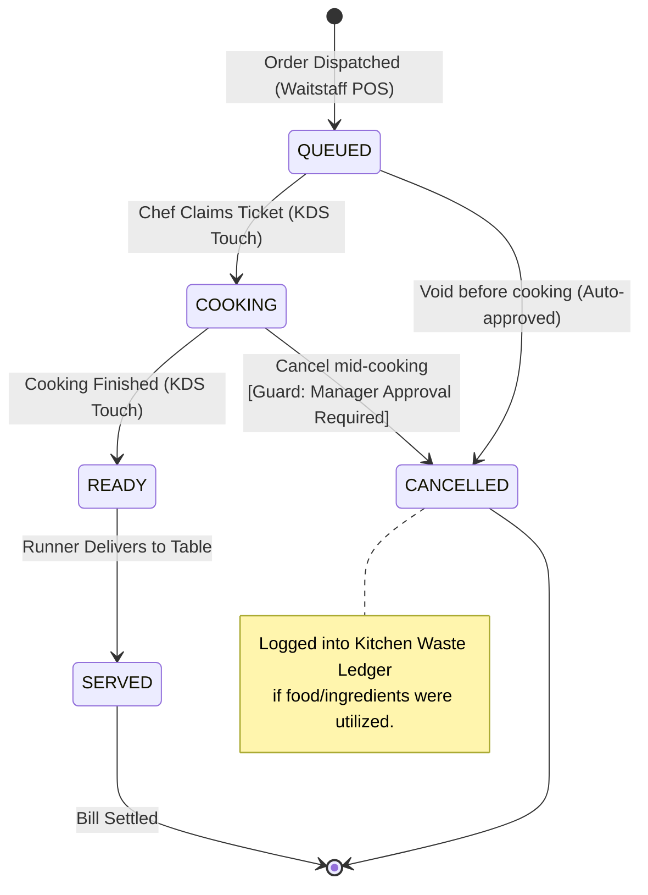

---

## 1.2. Dining Table Lifecycle (`DINING_TABLES`)

* **Objective**: Prevents double-booking, manages dining sessions, and synchronizes floor map color codes across all POS clients.

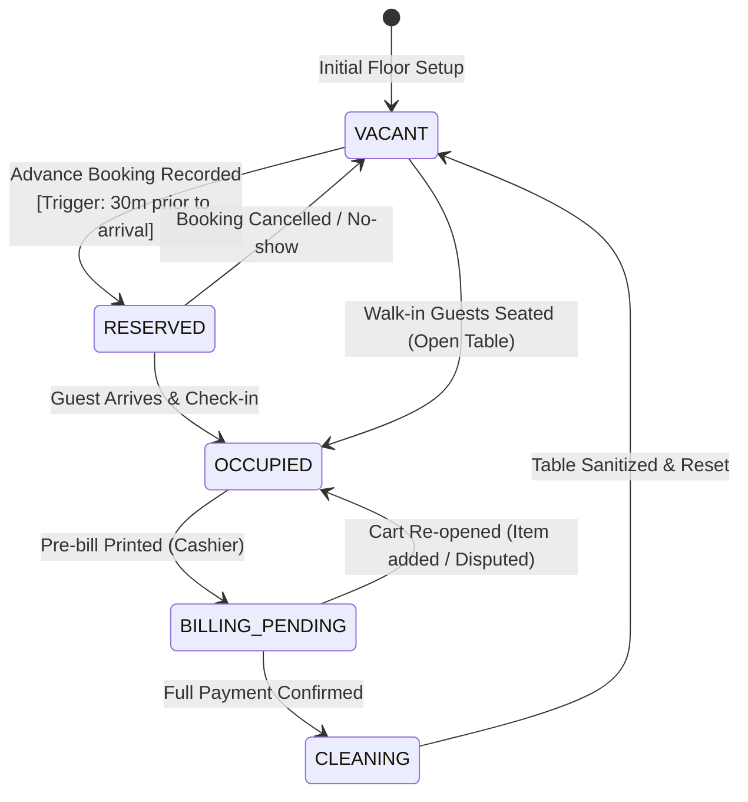

---

## 1.3. Invoice Lifecycle (`INVOICES`)

* **Objective**: Guarantees financial immutability so audited historical figures cannot be tampered with.

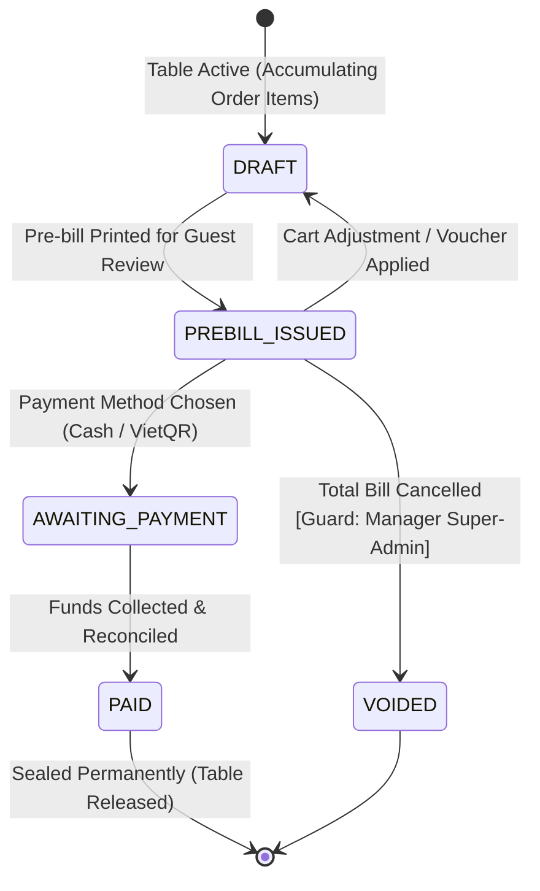

---

# PART 2: SEQUENCE DIAGRAMS (14 Technical Flows)

## 2.1. Staff Authentication (Manager JWT / Server Quick PIN)

* **Mapped Use Cases**: `UC-SEC-AUTH`
* **Objective**: Provides instant 4-digit PIN switching for floor tablets while enforcing secure JWT for back office.

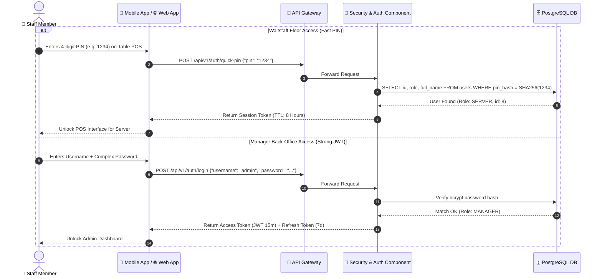

---

## 2.2. Open Table & Dining Session Initialization

* **Mapped Use Cases**: `UC-POS-PRI-01`

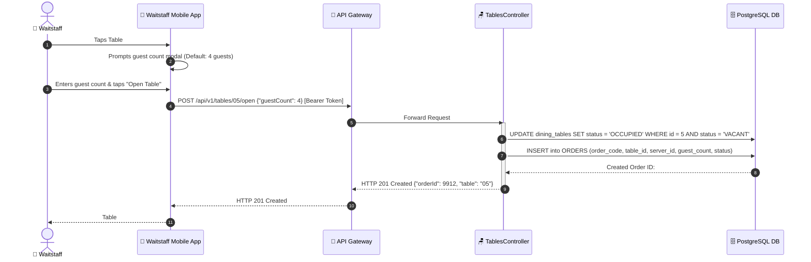

---

## 2.3. Table Transfer Workflow (Chuyển Bàn)

* **Mapped Use Cases**: `UC-EXT-01`
* **Objective**: Moves active orders from Table A to Table B atomically.

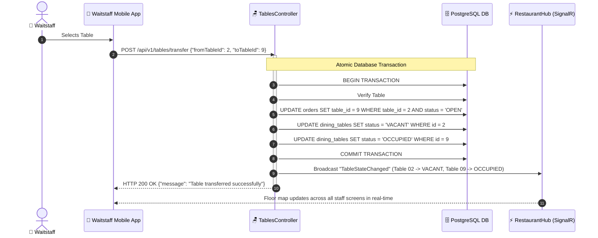

---

## 2.4. Table Merge Workflow (Gộp Bàn Tiệc)

* **Mapped Use Cases**: `UC-EXT-02`
* **Objective**: Merges multiple tables into one master dining bill.

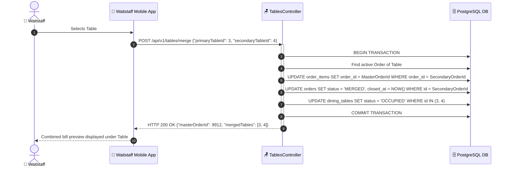

---

## 2.5. First-Round Ordering & Real-Time KDS Ticket Dispatch

* **Mapped Use Cases**: `UC-POS-PRI-02`, `UC-POS-PRI-03`, `UC-KIT-PRI-01`

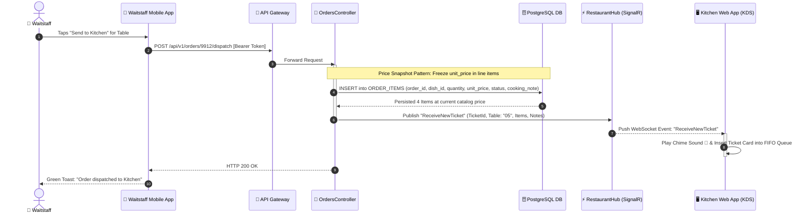

---

## 2.6. Subsequent Add-on Orders (`isAddon: true`)

* **Mapped Use Cases**: `UC-POS-SEC-02`
* **Objective**: Appends new dishes without resetting cooking progress of round-1 items.

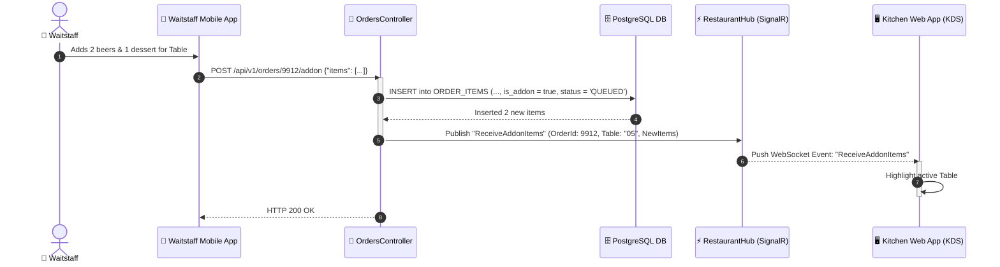

---

## 2.7. Kitchen Cooking Progression & Waitstaff Ready Alert

* **Mapped Use Cases**: `UC-KIT-PRI-02`, `UC-KIT-PRI-03`

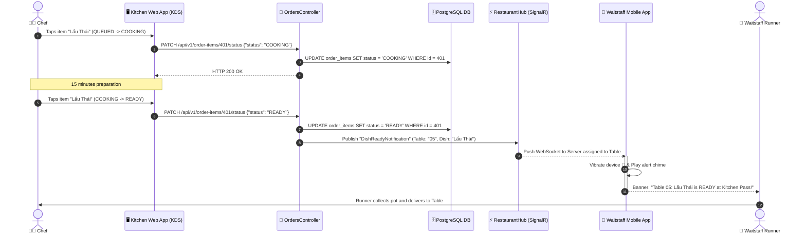

---

## 2.8. Instant Out-of-Stock (86) Freeze & Real-Time Sync

* **Mapped Use Cases**: `UC-KIT-SEC-02`
* **Objective**: Locks depleted dishes across all POS clients in $< 200\text{ ms}$.

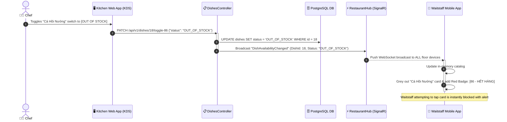

---

## 2.9. Voucher Validation & VIP Loyalty Point Redemption

* **Mapped Use Cases**: `UC-CSH-SEC-01`, `UC-CSH-SEC-02`

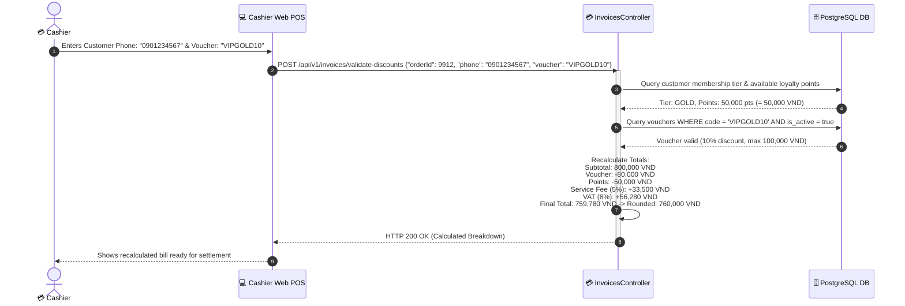

---

## 2.10. Pre-Bill Thermal Printing (80mm ESC/POS)

* **Mapped Use Cases**: `UC-CSH-PRI-01`

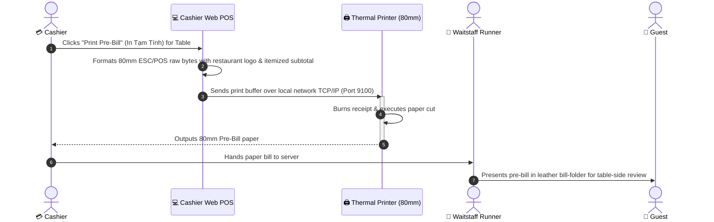

---

## 2.11. Cash Settlement & Automatic Change Calculation

* **Mapped Use Cases**: `UC-CSH-SEC-03`
* **Objective**: Zero mental math errors for cashiers during peak turnover.

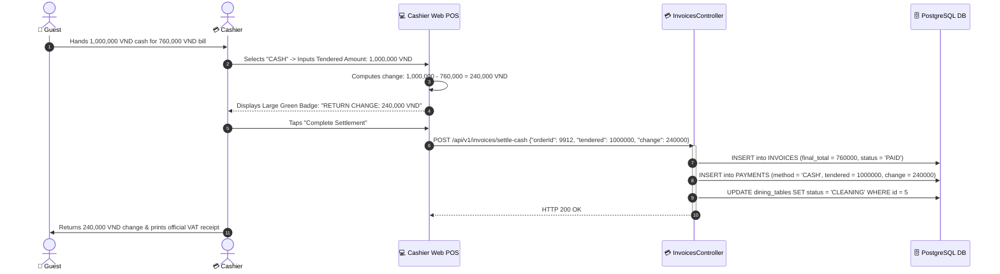

---

## 2.12. Dynamic VietQR Settlement & Bank Webhook Callback

* **Mapped Use Cases**: `UC-CSH-PRI-02`

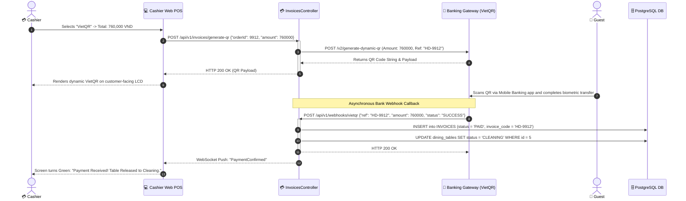

---

## 2.13. Dish Photo Upload to Media Storage

* **Mapped Use Cases**: `UC-MGR-PRI-01`
* **Objective**: Preserves database performance by storing binaries in MinIO/S3 and saving only URLs to PostgreSQL.

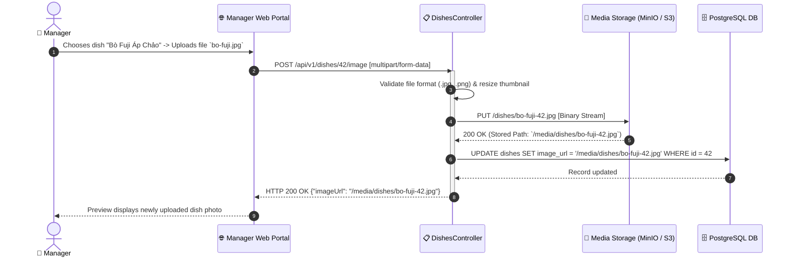

---

## 2.14. Shift Revenue & Gross Margin Analytics Query

* **Mapped Use Cases**: `UC-MGR-SEC-02`

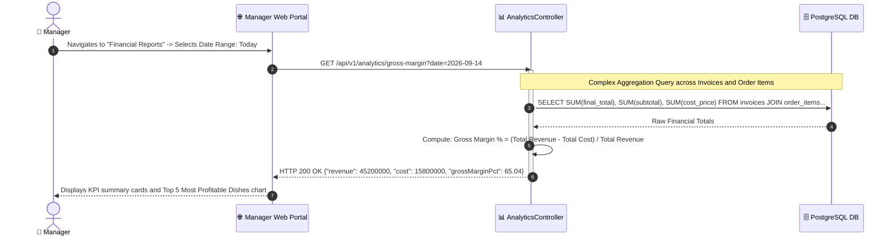

---

# PART 3: ACTIVITY DIAGRAMS (5 Business Workflows)

## 3.1. Advance Reservation & Walk-in Seating Flow

* **Mapped Use Cases**: `UC-EXT-05`, `UC-POS-PRI-01`

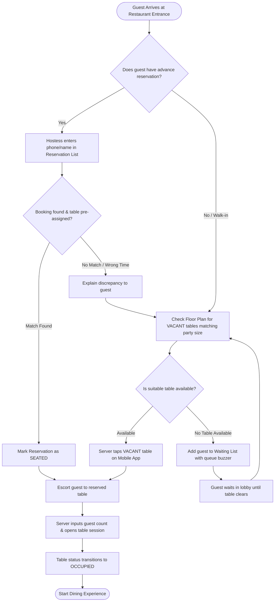

---

## 3.2. End-to-End Dining & Billing Cycle (4 Swimlanes)

* **Mapped Use Cases**: Full operational lifecycle across Customer, Server, Chef, and Cashier.

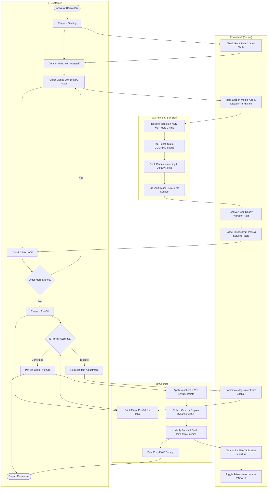

---

## 3.3. Void Item & Kitchen Waste Approval Process

* **Mapped Use Cases**: `UC-POS-SEC-03`, `UC-MGR-SEC-01`
* **Objective**: Prevents unrecorded food theft and enforces manager audit oversight.

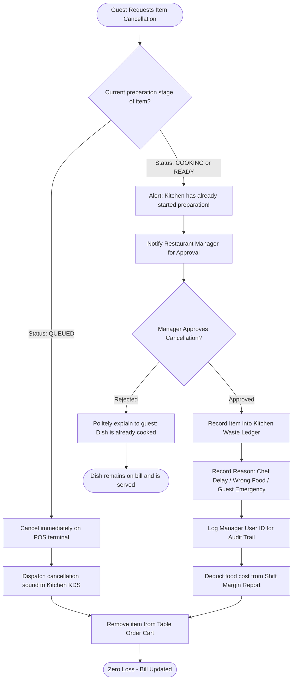

---

## 3.4. Split Bill & Divided Settlement Workflow

* **Mapped Use Cases**: `UC-EXT-03`
* **Objective**: Supports split dining parties paying by individual items or equal split.

```mermaid
flowchart TD
    START([Party Requests Separate Bills]) --> CHOOSE_SPLIT_TYPE{Split Method?}

    %% Method 1: Split by Items
    CHOOSE_SPLIT_TYPE -->|By Items Consumed| SELECT_ITEMS[Cashier assigns specific dishes to Bill A and Bill B]
    SELECT_ITEMS --> CALC_SUBTOTAL[System computes separate subtotal, tax & service fee per bill]

    %% Method 2: Equal Split
    CHOOSE_SPLIT_TYPE -->|Equal Division| INPUT_PERSONS[Cashier enters number of paying guests: N]
    INPUT_PERSONS --> DIVIDE_EQUAL[System divides Total Bill by N]

    CALC_SUBTOTAL --> PROCESS_A[Collect payment for Bill A: Cash / VietQR]
    DIVIDE_EQUAL --> PROCESS_A
  
    PROCESS_A --> CHECK_ALL_PAID{Are all split bills settled?}
    CHECK_ALL_PAID -->|No, pending Bill B| PROCESS_B[Collect payment for Bill B]
    PROCESS_B --> CHECK_ALL_PAID

    CHECK_ALL_PAID -->|Yes, All Paid| SEAL_INVOICES[Seal all sub-invoices with shared parent Order Code]
    SEAL_INVOICES --> RELEASE_TABLE[Update Table Status to CLEANING]
    RELEASE_TABLE --> END_SPLIT([Table Cycle Complete])
```

---

## 3.5. Cash Drawer Opening, Reconciliation & Handover

* **Mapped Use Cases**: `UC-EXT-04`
* **Objective**: Prevents cash shrinkage by enforcing double-entry blind counts during shift change.

```mermaid
flowchart TD
    START_SHIFT([Shift Starts]) --> COUNT_FLOAT[Cashier counts opening cash float: e.g. 2,000,000 VND]
    COUNT_FLOAT --> SUBMIT_OPEN[Submit 'Open Shift' in Web POS]
  
    SUBMIT_OPEN --> OPERATE[Process shift orders: Cash, Card, VietQR]
  
    OPERATE --> SHIFT_END([Shift Ends])
    SHIFT_END --> LOCK_STATION[Lock POS terminal to freeze further billing]
  
    LOCK_STATION --> BLIND_COUNT[Cashier performs blind count of physical cash drawer]
    BLIND_COUNT --> INPUT_PHYSICAL[Input physical cash amount into system]
  
    INPUT_PHYSICAL --> SYSTEM_AUDIT[System compares: Physical Cash vs Calculated Software Ledger]
    SYSTEM_AUDIT --> IS_MATCH{Does physical cash match ledger exactly?}

    IS_MATCH -->|Exact Match: Diff = 0| PRINT_Z[Print Fiscal Shift Z-Report]
  
    IS_MATCH -->|Discrepancy: Surplus or Deficit| JOINT_RECOUNT[Perform second blind count together with Manager]
    JOINT_RECOUNT --> STILL_DIFF{Still discrepant?}

    STILL_DIFF -->|Yes| WRITE_EXPLANATION[Cashier enters mandatory explanation note]
    WRITE_EXPLANATION --> MGR_COUNTERSIGN[Manager approves & countersigns discrepancy log]
    MGR_COUNTERSIGN --> PRINT_Z

    STILL_DIFF -->|No, miscount corrected| PRINT_Z

    PRINT_Z --> DROP_SAFE[Deposit cash surplus into restaurant safe]
    DROP_SAFE --> HANDOVER[Handover drawer with base float to incoming Cashier]
    HANDOVER --> FINISH([Shift Successfully Closed])
```

---

## 4. Quality & Compliance Summary

1. **Deterministic State Transitions**: No entity can transition illegally (e.g. an item cannot jump from `QUEUED` straight to `SERVED` without being marked `COOKING` and `READY`).
2. **Audit Accountability**: Every financial deviation (Item Void, Bill Dispute, Cash Drawer Discrepancy) requires explicit Manager authorization and persists in an immutable audit ledger.
3. **Hardware & Latency SLA**:
   * KDS ticket arrival latency: $\le 250\text{ ms}$ over SignalR WebSocket.
   * Instant 86 out-of-stock freeze: $\le 200\text{ ms}$ broadcast across all active mobile terminals.
   * Pre-bill thermal printing: $\le 800\text{ ms}$ execution over local TCP/IP port 9100.
