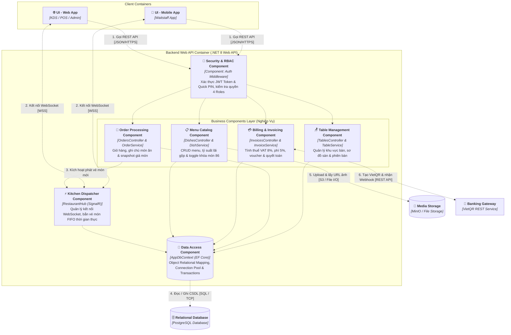

# Kiến Trúc Hệ Thống C4 Model (C4 Architecture Specification)

> **Dự án**: Hệ Thống Quản Lý Vận Hành Nhà Hàng (Restaurant Operations Management System - ROMS)**Tài liệu**: Đặc tả Kiến trúc Phần mềm theo chuẩn C4 (Simon Brown)**Cấu trúc 3 cấp độ**:
>
> 1. **Level 1 (System Context)**: Bối cảnh tổng thể, người dùng & hệ thống bên ngoài.
> 2. **Level 2 (Containers)**: Các khối ứng dụng thực thi độc lập (Mobile, Web, API, Database, Storage).
> 3. **Level 3 (Components)**: Bóc tách chi tiết cấu trúc bên trong khối xử lý lõi **Backend Web API** (Vẽ trực tiếp bằng Mermaid).

---

## 1. C4 Level 1: System Context Diagram (Bối Cảnh Hệ Thống)

Cấp độ 1 thể hiện ranh giới hệ thống **ROMS Core System** ở trung tâm như một hộp đen, các tác nhân nhân sự vận hành (`Wait Staff`, `Kitchen Staff`, `Cashier`, `Manager`) và 2 hệ thống vệ tinh bên ngoài (`Printer`, `Banking Gateway`).

  
  
Sơ đồ 1: C4 Level 1 - System Context Diagram

### Bảng Thành Phần & Tương Tác C4 Level 1:

| Thực Thể (Entity)            | Phân Loại C4  | Vai Trò & Trách Nhiệm Nghiệp Vụ                                                         | Giao Thức Kết Nối      |
| :----------------------------- | :-------------- | :------------------------------------------------------------------------------------------- | :------------------------ |
| **👤 Wait Staff**        | Person          | Mở bàn, chọn món tại bàn ăn, ghi chú khẩu vị và gửi đơn xuống bếp.           | `[HTTPS]`               |
| **👨‍🍳 Kitchen Staff** | Person          | Tiếp nhận vé món theo FIFO, cập nhật công đoạn nấu và khóa món hết hàng (86). | `[SignalR / WebSocket]` |
| **💳 Cashier**           | Person          | In phiếu tạm tính, kiểm tra đối soát, tính tiền thừa và quyết toán hóa đơn.  | `[HTTPS]`               |
| **👔 Manager**           | Person          | Quản lý thực đơn, cấu hình giá bán/VAT, duyệt hủy món và xem doanh thu ca.      | `[HTTPS]`               |
| **🏢 ROMS Core System**  | Software System | Hệ thống phần mềm cốt lõi điều phối vận hành phòng ăn, bếp và thu ngân.      | Hệ thống trung tâm     |
| **🖨️ Printer**         | External System | Máy in nhiệt 80mm xuất phiếu tạm tính và hóa đơn thanh toán VAT.                  | `[ESC/POS]`             |
| **🏦 Banking Gateway**   | External System | Cổng thanh toán sinh mã VietQR động và bắn Webhook báo tiền về tài khoản.        | `[REST API / Webhook]`  |

---

## 2. C4 Level 2: Container Diagram (Kiến Trúc Các Khối Thực Thi)

Cấp độ 2 "mở nắp" ranh giới ROMS Core System để bóc tách các ứng dụng thực thi độc lập theo đúng đặc thù phần cứng F&B:

* **Wait Staff** dùng **Mobile App** cầm tay di động.
* **Kitchen, Cashier, Manager** dùng **Web App** (chế độ Kiosk bếp, POS thu ngân, Admin portal).
* Hệ thống phân luồng qua **API Gateway**, xử lý nghiệp vụ bởi **Backend Web API**, đẩy vé Real-time qua **SignalR Hub**, lưu trữ phân tách giữa **PostgreSQL Database** và **Media Storage**.

  
  
Sơ đồ 2: C4 Level 2 - Container Diagram

### Bảng Chi Tiết Container C4 Level 2:

| Container                     | Nền Tảng / Công Nghệ          | Trách Nhiệm Vận Hành & Thực Thi                                                                                                     |
| :---------------------------- | :-------------------------------- | :--------------------------------------------------------------------------------------------------------------------------------------- |
| **UI - Mobile App**     | `Flutter / Android Native`      | Ứng dụng di động cầm tay cho phục vụ: Mở bàn, chọn món 1 chạm, nhận rung khi món nấu xong.                                |
| **UI - Web App**        | `React / Vanilla JS / Tailwind` | Ứng dụng Web đa giao diện: Màn hình KDS Bếp toàn màn hình, Quầy POS thu ngân kết nối máy in, Back Office quản lý.       |
| **API Gateway**         | `Reverse Proxy / Nginx`         | Điểm tiếp nhận duy nhất: Chấm dứt SSL/TLS, định tuyến HTTP sang Backend và WebSocket sang Realtime Hub.                       |
| **Backend Web API**     | `C# .NET 8 Web API`             | Engine xử lý logic: Tính toán tài chính (VAT 8%, Phí 5%), xác thực JWT/PIN, kiểm soát giao dịch đơn hàng.                 |
| **Realtime Event Hub**  | `ASP.NET Core SignalR`          | Kênh WebSocket 2 chiều: Bắn vé món FIFO tức thì xuống màn hình KDS và đẩy cảnh báo món xong về điện thoại phục vụ. |
| **Relational Database** | `PostgreSQL Database`           | Lưu trữ dữ liệu quan hệ có cấu trúc: Sơ đồ bàn, menu, đơn hàng, người dùng và snapshot hóa đơn bất biến.         |
| **Media Storage**       | `Local Storage / MinIO / S3`    | Kho lưu trữ nhị phân chuyên biệt cho ảnh món ăn thực đơn, ảnh thumbnail và tài nguyên thương hiệu.                    |

---

## 3. C4 Level 3: Component Diagram (Bóc Tách Backend Web API)

Theo nguyên lý thiết kế C4 của Simon Brown, cấp độ 3 tập trung phóng to vào Container có độ phức tạp nghiệp vụ cao nhất là **`Backend Web API`**. Toàn bộ mã nguồn bên trong được nhóm thành **6 Components nghiệp vụ cốt lõi** thực thi trong cùng một tiến trình:

---

### Bảng Phân Công Nhiệm Vụ Từng Component (C4 Level 3):

| Component Name                          | File / Lớp Mã Nguồn                               | Trách Nhiệm Chi Tiết Trong Backend                                                                                                                                                |
| :-------------------------------------- | :--------------------------------------------------- | :----------------------------------------------------------------------------------------------------------------------------------------------------------------------------------- |
| **Security & RBAC Component**     | `JwtMiddleware.cs`, `AuthorizeRolesAttribute.cs` | Xác thực danh tính qua JWT Token hoặc Quick PIN 4 số, phân luồng quyền truy cập theo 4 nhóm`SERVER`, `KITCHEN`, `CASHIER`, `MANAGER`.                              |
| **Table Management Component**    | `TablesController.cs`, `TableService.cs`         | Xử lý sơ đồ sàn, chuyển đổi trạng thái bàn ăn (`VACANT` $\leftrightarrow$ `OCCUPIED` $\leftrightarrow$ `RESERVED`), khởi tạo mã phiên ăn `Order ID`.   |
| **Order Processing Component**    | `OrdersController.cs`, `OrderService.cs`         | Xử lý giỏ hàng gọi món, đính kèm ghi chú chế biến, gọi thêm món đợt sau (`isAddon`), và **lưu snapshot giá vốn/giá bán tại thời điểm gọi**.      |
| **Kitchen Dispatcher Component**  | `RestaurantHub.cs` *(SignalR Hub)*               | Duy trì kết nối WebSocket thời gian thực, bắn vé món FIFO xuống KDS bếp ngay khi bồi bàn gửi đơn; đẩy thông báo món nấu xong về điện thoại phục vụ.       |
| **Billing & Invoicing Component** | `InvoicesController.cs`, `BillingService.cs`     | Thực hiện thuật toán tài chính: Áp dụng Voucher/Điểm tích lũy$\to$ Cộng 5% phí phục vụ $\to$ Cộng 8% thuế VAT $\to$ Làm tròn VND. Giao tiếp cổng VietQR. |
| **Menu Catalog Component**        | `DishesController.cs`, `DishService.cs`          | Quản trị cây danh mục món, tính toán Gross Margin %, bật/tắt tức thì trạng thái hết món (86), và giao tiếp với Media Storage để quản lý ảnh món.             |
| **Data Access Component**         | `AppDbContext.cs` *(Entity Framework Core)*      | Đóng gói toàn bộ câu lệnh truy vấn LINQ/SQL, ánh xạ quan hệ bảng CSDL quan hệ và quản lý tính bất biến của các giao dịch (DB Transactions).                    |

---

## 4. Tổng Kết Giá Trị Kiến Trúc C4 Của Hệ Thống

1. **Tính Thực Tiễn Phần Cứng (Hardware Awareness)**: Kiến trúc phân tách rõ ràng giữa ứng dụng di động cho nhân viên phục vụ bàn (`Mobile App`) và ứng dụng Kiosk/Desktop cho Bếp & Thu ngân (`Web App`), phản ánh đúng thực tế vận hành F&B.
2. **Đảm Bảo Tính Thời Gian Thực (Real-time Latency $\le 300\text{ms}$)**: Nhờ có `Realtime Event Hub (SignalR)` chạy song song với `Backend Web API`, vé gọi món được đẩy tức thì xuống bếp mà không tạo tải nghẽn lên các API polling.
3. **Phân Tách Dữ Liệu Rõ Ràng (Data Segregation)**: Dữ liệu giao dịch tài chính lưu trong PostgreSQL ACID, trong khi dữ liệu ảnh món ăn lưu trữ độc lập tại Media Storage, ngăn ngừa việc phình to CSDL ngoài tầm kiểm soát.
