# Sơ Đồ Thực Thể Quan Hệ Cơ Sở Dữ Liệu (Database ERD)
**Hệ Thống Quản Lý Vận Hành Nhà Hàng (Gia Vị Việt POS & Back Office)**

Tài liệu này thể hiện cấu trúc lược đồ Cơ sở dữ liệu và quan hệ giữa các bảng (Entities) được phân tích từ sơ đồ nghiệp vụ [`docs/top-down-approach-mindmap.png`](top-down-approach-mindmap.png) và tệp định nghĩa DBML [`docs/schema.dbml`](schema.dbml).

---

## 1. Sơ Đồ Trực Quan Mermaid ERD (Đầy Đủ Các Trường & Quan Hệ)

```mermaid
erDiagram
    ROLES ||--o{ USERS : "phân_quyền (1:N)"
    CATEGORIES ||--o{ DISHES : "phân_nhóm (1:N)"
    
    DINING_TABLES ||--o{ ORDERS : "phục_vụ_tại (1:N)"
    DINING_TABLES ||--o{ RESERVATIONS : "giữ_chỗ (1:N)"
    
    USERS ||--o{ ORDERS : "nhân_viên_mở_bàn (1:N)"
    ORDERS ||--|{ ORDER_ITEMS : "chi_tiết_gọi_món (1:N)"
    DISHES ||--o{ ORDER_ITEMS : "được_chọn_gọi (1:N)"
    USERS ||--o{ ORDER_ITEMS : "quản_lý_duyệt_hủy (1:N)"
    
    ORDERS ||--|| INVOICES : "chốt_hóa_đơn (1:1)"
    CUSTOMERS ||--o{ INVOICES : "tích_điểm_thành_viên (1:N)"
    VOUCHERS ||--o{ INVOICES : "áp_dụng_khuyến_mãi (1:N)"
    USERS ||--o{ INVOICES : "thu_ngân_chốt (1:N)"
    
    INVOICES ||--|{ PAYMENTS : "thanh_toán_qua (1:N)"

    ROLES {
        bigint id PK "Khóa chính"
        varchar name "Tên role: ADMIN, CASHIER, SERVER, KITCHEN"
        text description "Mô tả quyền hạn vai trò"
    }

    USERS {
        bigint id PK "Khóa chính"
        varchar username "Tên đăng nhập (Unique)"
        varchar password_hash "Mật khẩu băm an toàn"
        varchar full_name "Họ và tên nhân viên"
        bigint role_id FK "Liên kết vai trò: roles.id"
        varchar phone "Số điện thoại liên hệ"
        boolean is_active "Trạng thái hoạt động"
        timestamp created_at "Thời điểm tạo tài khoản"
    }

    CATEGORIES {
        bigint id PK "Khóa chính"
        varchar name "Tên nhóm: Khai vị, Bò, Hải sản, Lẩu..."
        int display_order "Thứ tự sắp xếp trên menu POS"
        boolean is_active "Đang áp dụng kinh doanh"
    }

    DISHES {
        bigint id PK "Khóa chính"
        bigint category_id FK "Thuộc nhóm: categories.id"
        varchar sku "Mã định danh món (Unique, vd: BO-FUJI-01)"
        varchar name "Tên món ăn"
        bigint price "Giá bán niêm yết hiện tại (VNĐ)"
        bigint cost_price "Giá vốn dự toán phục vụ tính margin"
        varchar unit "Đơn vị tính: Đĩa, Phần, Nồi, Ly"
        text image_url "Đường dẫn hình ảnh món"
        varchar status "Trạng thái: AVAILABLE | OUT_OF_STOCK | DISCONTINUED"
        boolean is_bestseller "Đánh dấu món bán chạy"
        int vat_rate "Thuế suất VAT (%)"
        timestamp created_at "Ngày tạo món"
    }

    DINING_TABLES {
        bigint id PK "Khóa chính"
        varchar table_number "Số bàn hiển thị (Unique, vd: 01, 05, VIP-1)"
        varchar zone "Khu vực: Tầng 1, Tầng 2, Sân vườn"
        int capacity "Sức chứa tối đa (số khách)"
        varchar status "Trạng thái: VACANT | OCCUPIED | RESERVED | CLEANING"
    }

    RESERVATIONS {
        bigint id PK "Khóa chính"
        bigint table_id FK "Bàn gán trước: dining_tables.id (Nullable)"
        varchar customer_name "Họ tên người đặt"
        varchar phone "Số điện thoại"
        int party_size "Số lượng khách dự kiến"
        timestamp reservation_time "Thời gian khách hẹn đến"
        varchar status "Trạng thái: PENDING | CONFIRMED | SEATED | CANCELLED"
    }

    ORDERS {
        bigint id PK "Khóa chính"
        varchar order_code "Mã phiên đơn (Unique, vd: #ORD-8821)"
        bigint table_id FK "Bàn đang phục vụ: dining_tables.id"
        bigint server_id FK "Nhân viên phục vụ mở bàn: users.id"
        int guest_count "Số lượng khách ngồi thực tế"
        varchar status "Trạng thái: OPEN | COOKING | SERVED | COMPLETED"
        timestamp opened_at "Thời điểm mở bàn đón khách"
        timestamp closed_at "Thời điểm đóng đơn / giải phóng bàn"
    }

    ORDER_ITEMS {
        bigint id PK "Khóa chính"
        bigint order_id FK "Thuộc đơn hàng: orders.id"
        bigint dish_id FK "Món ăn được gọi: dishes.id"
        int quantity "Số lượng món gọi"
        bigint unit_price "SNAPSHOT: Giá bán tại thời điểm gọi món"
        varchar cooking_note "Ghi chú bếp: Ít ngọt, Không cay, Nóng..."
        varchar status "Trạng thái: QUEUED | COOKING | READY | SERVED | CANCELLED"
        bigint approved_by FK "Quản lý duyệt hủy món: users.id (Nullable)"
        timestamp sent_to_kitchen_at "Thời điểm gửi thông tin xuống bếp"
    }

    CUSTOMERS {
        bigint id PK "Khóa chính"
        varchar phone "Số điện thoại thành viên (Unique)"
        varchar full_name "Họ tên khách hàng"
        varchar membership_tier "Hạng thẻ: STANDARD | SILVER | GOLD | PLATINUM"
        int loyalty_points "Điểm tích lũy hiện có"
    }

    VOUCHERS {
        bigint id PK "Khóa chính"
        varchar code "Mã giảm giá nhập (Unique, vd: VIPGOLD10)"
        varchar discount_type "Loại giảm: PERCENTAGE | FIXED_AMOUNT"
        bigint discount_value "Giá trị giảm (10% hoặc 20.000đ)"
        boolean is_active "Trạng thái kích hoạt"
    }

    INVOICES {
        bigint id PK "Khóa chính"
        varchar invoice_code "Mã hóa đơn VAT (Unique, vd: #HD-2026-0001)"
        bigint order_id FK "Đơn hàng được thanh toán: orders.id (Quan hệ 1:1)"
        bigint customer_id FK "Khách hàng tích điểm: customers.id (Nullable)"
        bigint voucher_id FK "Mã khuyến mãi áp dụng: vouchers.id (Nullable)"
        bigint subtotal "SNAPSHOT: Tổng tiền nguyên giá các món ăn"
        bigint voucher_discount "SNAPSHOT: Số tiền giảm trừ từ voucher"
        bigint points_discount "SNAPSHOT: Số tiền giảm trừ từ điểm thưởng"
        bigint service_fee_amount "SNAPSHOT: Số tiền phí dịch vụ (5%)"
        bigint vat_amount "SNAPSHOT: Số tiền thuế GTGT (8%)"
        bigint final_total "SNAPSHOT: TỔNG TIỀN PHẢI THU (Đã làm tròn)"
        bigint cashier_id FK "Thu ngân chốt đơn: users.id"
        timestamp created_at "Thời điểm xuất hóa đơn"
    }

    PAYMENTS {
        bigint id PK "Khóa chính"
        bigint invoice_id FK "Hóa đơn được thanh toán: invoices.id"
        varchar payment_method "Phương thức: CASH | VIETQR | CARD | WALLET"
        bigint amount_paid "Số tiền thực tế thanh toán qua kênh này"
        bigint amount_tendered "Số tiền khách đưa (nếu là tiền mặt)"
        bigint change_given "Số tiền thối lại cho khách (nếu là tiền mặt)"
        varchar transaction_ref "Mã giao dịch ngân hàng / VietQR"
        timestamp paid_at "Thời điểm xác nhận thanh toán"
    }
```

---

## 2. Giải Thích Bản Chất Các Mối Quan Hệ (Cardinality)

| Mối quan hệ | Ký hiệu Mermaid | Ý nghĩa nghiệp vụ thực tế |
| :--- | :---: | :--- |
| `ROLES` $\rightarrow$ `USERS` | `||--o{` (1 - N) | 1 Vai trò (Phục vụ, Thu ngân, Bếp, Quản lý) được gán cho nhiều nhân viên. |
| `CATEGORIES` $\rightarrow$ `DISHES` | `||--o{` (1 - N) | 1 Nhóm thực đơn (Khai vị, Lẩu, Đồ uống) chứa nhiều món ăn. |
| `DINING_TABLES` $\rightarrow$ `ORDERS` | `||--o{` (1 - N) | 1 Bàn ăn qua thời gian sẽ tiếp đón nhiều lượt đơn hàng khác nhau. |
| `ORDERS` $\rightarrow$ `ORDER_ITEMS` | `||--|{` (1 - N) | 1 Đơn hàng bắt buộc phải có ít nhất 1 dòng món ăn được gọi. |
| `DISHES` $\rightarrow$ `ORDER_ITEMS` | `||--o{` (1 - N) | 1 Món ăn trên menu có thể xuất hiện trong nhiều lần gọi món của nhiều đơn. |
| `ORDERS` $\rightarrow$ `INVOICES` | `||--||` (1 - 1) | Mỗi phiên phục vụ bàn chốt đúng 1 Hóa đơn thanh toán duy nhất. |
| `INVOICES` $\rightarrow$ `PAYMENTS` | `||--|{` (1 - N) | 1 Hóa đơn có thể thanh toán bằng 1 hoặc nhiều giao dịch (hỗ trợ thanh toán hỗn hợp: 50% tiền mặt + 50% VietQR, hoặc tách bill). |
| `USERS` $\rightarrow$ `ORDER_ITEMS` | `||--o{` (1 - N) | Khóa ngoại `approved_by` lưu ID Quản lý đã ký duyệt hủy món khi món đã gửi bếp. |
