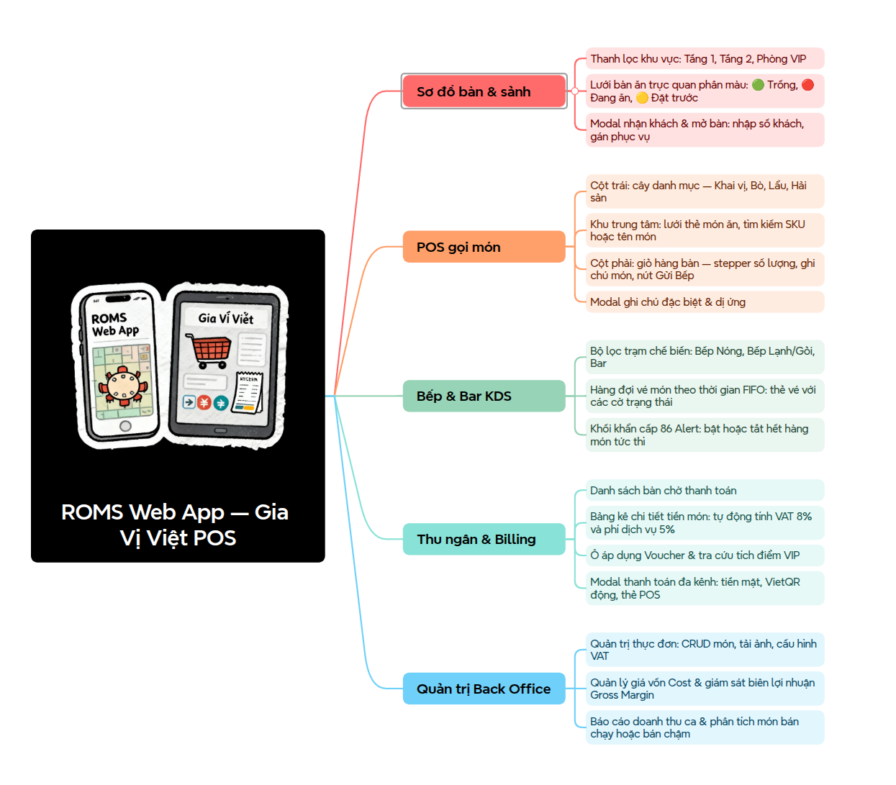
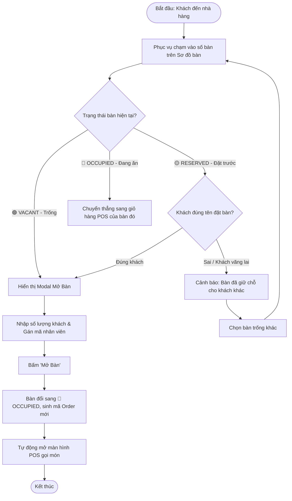
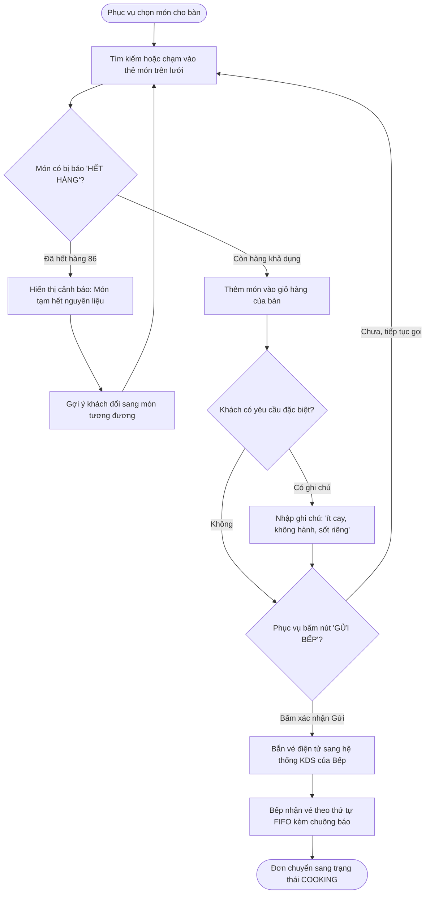
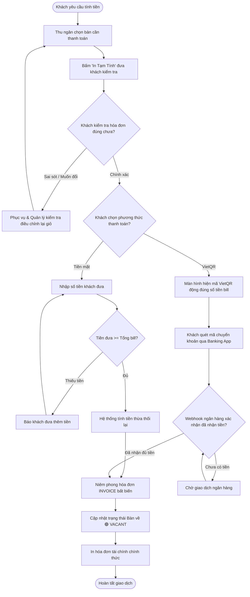
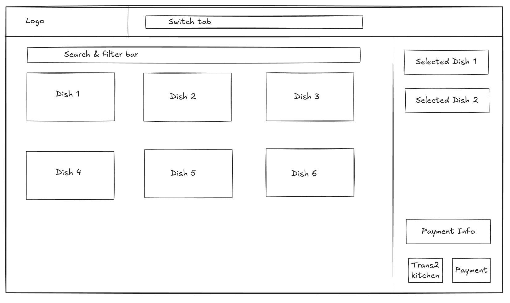
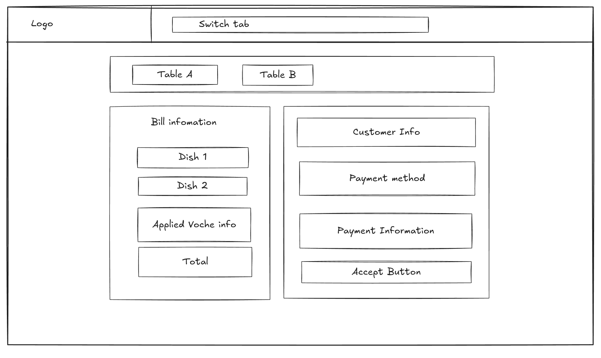

# Kiến Trúc Thông Tin Hệ Thống (Information Architecture - IA)

**Hệ Thống Quản Lý Vận Hành Nhà Hàng (Gia Vị Việt POS & Back Office)**

Tài liệu này là bản vẽ kỹ thuật toàn diện về **Kiến trúc Thông tin (Information Architecture - IA)** của hệ thống, chuẩn hóa luồng dữ liệu, phân bổ không gian màn hình và từ điển giao diện phục vụ trực tiếp cho bước **Mockup / UI/UX** và **Database Design (DBML)**.

---

## 1. Bản Đồ Phân Cấp Màn Hình (Sitemap & Screen Hierarchy)

Sơ đồ cây thể hiện toàn bộ các màn hình, các khung popup (Modals) và phân nhóm chức năng của ứng dụng:



---

## 2. Lưu Đồ Nhiệm Vụ & Điểm Rẽ Nhánh Điều Kiện (Task Flows & Decision Points)

Để hệ thống không bị lỗi góc chết (Dead-ends), người làm IA phải thiết kế rõ các **điểm kiểm tra điều kiện (Hình thoi If/Else)**:

### 2.1. Task Flow 1: Mở Bàn & Đón Khách (Table Seating Flow)



---

### 2.2. Task Flow 2: Chọn Món, Kiểm Tra Tồn Kho & Gửi Bếp (POS Order Flow)



---

### 2.3. Task Flow 3: Quyết Toán Hóa Đơn & Giải Phóng Bàn (Billing & Settlement Flow)



---

## 3. Khung Dây Giao Diện 2 Chiều (Low-Fidelity Spatial Wireframes)

Phân bổ diện tích giao diện 2 chiều theo chuẩn công thái học thao tác nhanh trên màn hình cảm ứng:

### 3.1. Wireframe Màn Hình POS Gọi Món (Table-Side POS Ordering)



* **Bố cục không gian**:
  * **Header**: Thanh chuyển tab điều hướng nhanh (`Switch tab`) và thương hiệu quán (`Logo`).
  * **Khu vực trung tâm**: Thanh tìm kiếm và bộ lọc (`Search & filter bar`) nằm trên lưới món ăn 6 ô trực quan (`Dish 1` đến `Dish 6`).
  * **Cột phải (Giỏ hàng & Quyết toán)**: Danh sách món đã chọn (`Selected Dish 1`, `Selected Dish 2`), khối tổng quan thanh toán (`Payment Info`) và 2 nút hành động: chuyển đơn xuống bếp (`Trans2 kitchen`) hoặc chuyển sang quầy thu ngân (`Payment`).

---

### 3.2. Wireframe Màn Hình Bếp & Bar KDS (Kitchen Display System)


* **Bố cục không gian**:
  * **Hàng đợi vé theo bàn**: Trực quan hóa các phiếu yêu cầu chế biến theo từng bàn ăn (`Table A`, `Table B`...).
  * **Thân vé**: Liệt kê chi tiết từng món ăn (`Dish 1`, `Dish 2`) kèm trạng thái món.
  * **Chân vé**: Nút bấm một chạm `Completed` để đầu bếp báo hoàn tất từng vé món, đồng bộ tức thì cho nhân viên sảnh lên món.

---

### 3.3. Wireframe Màn Hình Thu Ngân & Thanh Toán (Cashier & Invoicing)



* **Bố cục không gian**:
  * **Thanh chọn bàn**: Liệt kê trực quan các bàn đang chờ thanh toán (`Table A`, `Table B`...).
  * **Cột trái (Bill Information)**: Chi tiết danh sách món đã dùng (`Dish 1`, `Dish 2`), mục áp dụng Voucher giảm giá (`Applied Voucher Info`) và tổng tiền thanh toán (`Total`).
  * **Cột phải (Payment Information)**: Thông tin hội viên / khách hàng (`Customer Info`), bộ chọn phương thức (`Payment method`: Tiền mặt, VietQR, Thẻ POS) và nút xác nhận thanh toán (`Accept Button`).

---

### 3.4. Wireframe Màn Hình Quản Trị Thực Đơn & Doanh Thu (Admin Dashboard)


* **Bố cục không gian**:
  * **Khu vực tổng quan (Overview Info)**: Khối KPI thể hiện số lượng món đang bán, tổng doanh thu ca và tỷ suất Gross Margin trung bình.
  * **Bảng danh sách thực đơn (Dish List)**: Quản lý chi tiết từng món ăn (`Dish 1 Information`, `Dish 2 Information`...) gồm SKU, đơn giá bán, giá vốn (Cost) và công tắc bật/tắt kinh doanh.

---

## 4. Phân Loại Học & Siêu Dữ Liệu Tìm Kiếm (Taxonomy & Metadata)

Để hỗ trợ nhân viên sảnh lọc món dưới 3 giây trong giờ cao điểm, cấu trúc thực đơn được gán các tầng siêu dữ liệu:

### 4.1. Cây Phân Loại Thực Đơn (Taxonomy Hierarchy)

* **Cấp 1 - Loại hình phục vụ (Service Type)**: `Đồ Ăn (Food)` | `Đồ Uống (Beverage)`
* **Cấp 2 - Phân nhóm thực đơn (Category Group)**:
  * `Món Khai Vị` (Appetizers)
  * `Món Bò & Bê` (Beef Specialties)
  * `Hải Sản Tươi Sống` (Seafood)
  * `Lẩu Đặc Biệt` (Hotpot)
  * `Đồ Uống & Rượu` (Drinks & Liquor)
  * `Tráng Miệng` (Desserts)
* **Cấp 3 - Thuộc tính vị giác (Taste Tag)**:
  * `Cay nhiều (Hot Spicy)` | `Cay nhẹ (Mild)` | `Không cay (Non-spicy)`
  * `Món Chay (Vegetarian)` | `Món Đặc Sản (Chef's Signature)`

### 4.2. Bảng Siêu Dữ Liệu Tìm Kiếm Trên POS (Metadata Schema)

| Trường Metadata | Kiểu dữ liệu | Mục đích hiển thị & Lọc trên POS                                         |
| :---------------- | :-------------- | :------------------------------------------------------------------------------ |
| `sku`           | `String`      | Mã quét nhanh của thu ngân/phục vụ (vd:`BO-FUJI-01`, `LAU-TY-02`).    |
| `name`          | `String`      | Tên tiếng Việt có dấu, hỗ trợ tìm kiếm không dấu (fuzzy search).     |
| `price`         | `Integer`     | Giá bán niêm yết hiện hành (VNĐ).                                        |
| `cost_price`    | `Integer`     | Giá vốn nội bộ (phục vụ tính Gross Margin % cho Back Office).            |
| `unit`          | `String`      | Đơn vị định lượng:*Đĩa, Phần, Nồi, Ly, Lon, Chai*.                 |
| `status`        | `Enum`        | `AVAILABLE` (Hiển thị bán) / `OUT_OF_STOCK` (Làm mờ, khóa nút bấm). |
| `is_bestseller` | `Boolean`     | Gắn nhãn badge cam nổi bật`Best Seller` trên góc thẻ món.             |
| `vat_rate`      | `Integer`     | Thuế suất theo danh mục: Mặc định`8%` đối với đồ ăn F&B.          |

---

## 5. Từ Điển Từ Vựng & Dán Nhãn Chuẩn Hóa (Nomenclature & Labeling)

Quy định thống nhất 100% về từ ngữ trên giao diện để tránh việc lập trình viên đặt nhãn lộn xộn:

### 5.1. Nhãn Các Nút Bấm Hành Động (Action Buttons)

| Nút trên giao diện | Thống nhất dùng từ              | TUYỆT ĐỐI KHÔNG DÙNG            | Ý nghĩa nghiệp vụ                                               |
| :-------------------- | :---------------------------------- | :----------------------------------- | :------------------------------------------------------------------ |
| Nút mở bàn         | **Mở Bàn**                  | Nhận khách, Tạo đơn, Bắt đầu | Kích hoạt phiên bàn từ Trống sang Có khách.                 |
| Nút gửi order       | **Gửi Bếp**                 | Đặt món, Xác nhận, Mua ngay     | Đẩy danh sách món đã chọn vào KDS bếp.                     |
| Nút in bill kiểm    | **In Tạm Tính**             | Pre-bill, In thử, In hóa đơn     | In phiếu nhiệt 80mm cho khách kiểm tra tại bàn.               |
| Nút chốt tiền      | **Chốt Đơn & Thanh Toán** | Xong, Đóng tiền, Trả tiền       | Niêm phong hóa đơn, cập nhật doanh thu và giải phóng bàn. |
| Nút báo hết món   | **Báo Hết Món (86)**       | Hết hàng, Khóa món, Ẩn món     | Công tắc bếp khóa món trên POS sảnh.                         |

### 5.2. Nhãn Trạng Thái Bàn & Đơn Hàng (Status Badges)

| Mã Trạng Thái DB | Nhãn Tiếng Việt trên UI    | Màu sắc chuẩn (Color Code)     | Ý nghĩa hiển thị                                    |
| :------------------ | :----------------------------- | :-------------------------------- | :------------------------------------------------------ |
| `VACANT`          | **Bàn Trống**          | 🟢 Xanh lá (`#22c55e`)         | Bàn sạch, sẵn sàng đón khách mới vào ngồi.    |
| `OCCUPIED`        | **Đang Phục Vụ**      | 🔴 Đỏ cam (`#ef4444`)         | Bàn đang có khách ngồi ăn và đã mở order.     |
| `RESERVED`        | **Đã Đặt Trước**   | 🟡 Vàng hổ phách (`#f59e0b`) | Bàn đã có khách hẹn giờ đến.                   |
| `CLEANING`        | **Đang Dọn Dẹp**      | ⚪ Xám bạc (`#94a3b8`)        | Khách vừa tính tiền xong, phục vụ đang lau dọn. |
| `QUEUED`          | **Chờ Bếp Nhận**      | 🔵 Xanh dương (`#3b82f6`)     | Món mới bắn xuống KDS, đầu bếp chưa bắt đầu. |
| `COOKING`         | **Đang Chế Biến**     | 🟠 Cam đậm (`#f97316`)        | Bếp đang nấu trên chảo.                            |
| `READY`           | **Sẵn Sàng Lên Món** | 🟢 Xanh lục (`#10b981`)        | Món đã chín, chờ nhân viên bưng ra bàn.        |

---

## 6. Vị Trí Của Tài Liệu Trong Chuỗi Quy Trình

```
Bước 1: Top-Down Problem Statement & Lựa chọn 80/20 (README.md)
   │
Bước 2: Phân tích Roles & Sơ đồ Use Case (docs/01-requirements/usecase-auth-specification.md)
   │
Bước 3: Information Architecture - IA (Tài liệu này: docs/04-ui-ux/information-architecture.md)
   │
Bước 4: Mockup & Interactive Prototype (frontend/index.html)
   │
Bước 5: Database Architecture (DBML & ERD: docs/03-database/schema.dbml & docs/03-database/database-erd.md)
```

> 📄 **Tài liệu tham khảo liên quan**:
>
> * Sơ đồ Use Case Specification: [`docs/01-requirements/usecase-auth-specification.md`](../01-requirements/usecase-auth-specification.md)
> * Cơ sở dữ liệu ERD: [`docs/03-database/database-erd.md`](../03-database/database-erd.md) & [`docs/03-database/schema.dbml`](../03-database/schema.dbml)
> * Nguyên mẫu giao diện thực tế: [`frontend/index.html`](../../frontend/index.html)
